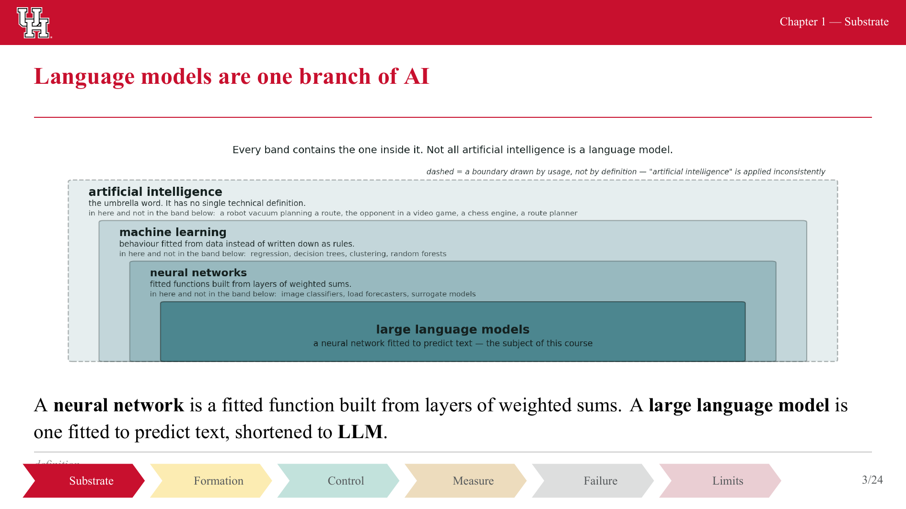

# Rebuilding the UHTraining Beamer theme as a PowerPoint theme

This is a by-hand reconstruction guide: everything a person needs to click through PowerPoint's
UI (Design tab, Slide Master view, Format Shape / Format Text panes) to reproduce the visual
design of the `UHTraining` Beamer theme, without LaTeX. It does not touch
`ai-training/` or `beamer-uhtraining/` — both are read separately as source of truth. Every
number below was either **read verbatim from the `.sty` source** or **measured from the compiled
PDF**; the method is stated at each measurement. Where a value could not be derived from either
and is a design judgement call for the PowerPoint rebuild (PowerPoint's 12-slot theme-colour
model has no Beamer equivalent, for instance), it is marked **INFERRED**.

## Source of truth and method

- Theme package: `/home/vx/Desktop/Claude/beamer-uhtraining/` — all eight `.sty` files read in
  full, plus `assets/`.
- Shared macros: `/home/vx/Desktop/Claude/AI Training/ai-training/slides/beamer/preamble.tex`,
  `uhcite.sty` (citation/provenance footer), and `uhslot.sty` (animation placeholder boxes,
  referenced only where relevant).
- Compiled reference: `01-substrate.pdf` (24 pages, page size 453.54 × 255.12 pt per `pdfinfo`).
  Two sibling decks compiled from the same theme, `02-formation.pdf` and `03-control.pdf`, were
  also rendered to check the chevron-flow bar's highlight state at two more positions — this is
  a small, justified extension beyond the single named PDF, using files built by the identical
  theme in the identical directory, not a new source of truth.
- Measurement tools: `pdfinfo` (page size), `pdftoppm -r 300` (raster render for pixel
  measurement, Python/Pillow for pixel-color and edge scanning), PyMuPDF (`fitz`) reading the
  PDF content stream directly for exact embedded font sizes (the `Tf`/glyph-matrix size PyMuPDF
  reports, not an assumption about what `\small` "should" produce). Every measured figure below
  states which of these produced it.

## 1. Slide size

Measured with `pdfinfo` on `01-substrate.pdf`: **453.54 × 255.12 pt** (PostScript points, 72/in
— this is what `pdfinfo` reports and what PDF page boxes use).

| Unit | Width | Height | Method |
|---|---|---|---|
| pt (measured) | 453.54 | 255.12 | `pdfinfo` |
| inch | 6.2992 | 3.5433 | pt ÷ 72 |
| **cm** | **16.00** | **9.00** | inch × 2.54 (exact: 15.9999 × 9.0001 cm) |
| mm | 160.00 | 90.00 | — matches the theme README's own statement: "every dimension in the theme is set against a 160 mm × 90 mm canvas" |

**Aspect ratio: 16:9 exactly** (453.54/255.12 = 1.77775 vs. 16/9 = 1.77778 — the 0.002% gap is
PDF point rounding, not a different ratio).

**PowerPoint click path:** Design tab → Slide Size → Custom Slide Size → set Width `16 cm`,
Height `9 cm` (type the unit suffix directly — PowerPoint accepts `cm`, `in`, or `px` typed into
either field regardless of your regional default) → OK → when prompted, choose **Maximize** (the
theme has no existing content to scale down; it does not matter which you pick on an empty deck).
Confirmed against Microsoft's own documentation for the Custom Slide Size dialog (see
`REFERENCES.md`); PowerPoint's stated bounds are 2.54–142.24 cm per side, so 16 × 9 cm is valid.

If your PowerPoint's regional settings show inches instead: **6.3 × 3.54 in** (round the true
6.2992 × 3.5433 in to PowerPoint's field precision, 2–3 decimal places depending on version).

## 2. Colour palette

All hex values below are read verbatim from `\definecolor{...}{HTML}{...}` in
`beamercolorthemeUHTraining.sty`, `beamercolorthemeUHConsole.sty`, `uhcite.sty`, and `uhslot.sty`
— none are estimated. The chevron pastel tints are the one derived set: they are computed with
xcolor's documented `color!P!white` convex-combination blend (`P`% of the named color + `(100−P)`%
white, per RGB channel) from the percentages hard-coded in `uhtraining-flow.sty`, and that
computation was cross-checked pixel-for-pixel against the rendered PDF (see §5) — every computed
tint below matched the rendered pixel color exactly, to the byte.

A rendered swatch sheet with every colour, its hex, and its usage is at
[`assets/colour-swatch-reference.png`](assets/colour-swatch-reference.png).

### Core palette

| Name | Hex | Used for |
|---|---|---|
| `uhred` | `#C8102E` | structure colour, frametitle text, logo band fill, current chevron |
| `uhblack` | `#000000` | normal text, light mode |
| `uhslate` | `#54585A` | framesubtitle, footline/slide-number text, inactive chevron label text |
| `uhbrick` | `#960C22` | alerted text; source hue for the "Limits" chevron tint |
| `uhchocolate` | `#640817` | **defined, never referenced** by any `\setbeamercolor` or macro |
| `uhcream` | `#FFF9D9` | title-page subtitle and date text (sits on the uhred field) |
| `uhgray` | `#888B8D` | console-mode framesubtitle/footline; the `>>>` console prompt |
| `uhgold` | `#F6BE00` | source hue for the "Formation" chevron tint |
| `uhmustard` | `#D89B00` | **defined, never referenced** by any `\setbeamercolor` or macro |
| `uhocher` | `#B97800` | animation-slot border/caption colour; source hue for "Measure" chevron tint |
| `uhteal` | `#00B388` | console-mode frametitle/prompt/itemize; source hue for "Substrate" chevron tint |
| `uhgreen` | `#00866C` | source hue for the "Control" chevron tint |
| `uhforest` | `#005950` | example text; `codeblock` listings string colour |
| white | `#FFFFFF` | light-mode canvas background — **not a named theme colour**, LaTeX's built-in `white` |

### Console mode (dark frames)

| Name | Hex | Used for |
|---|---|---|
| `uhconsolebg` | `#1E2224` | dark-frame canvas |
| `uhconsolefg` | `#E8E6E3` | dark-frame body text |

### Citation / provenance footer

| Name | Hex | Used for |
|---|---|---|
| `uhcitegrey` | `#6B7A7A` | **defined, never referenced** — the footer text actually uses grey *tints of black* (below), not this colour |
| `uhcitegreen` | `#2F7D3A` | the `[V]` "verified source" tag in `\citesource` |
| `uhcitered` | `#B3261E` | the `[?]`/unresolved-key tag, and error text for a bad citation key or unknown provenance word |

The footer's rule and body text are not named colours at all — they are percentage tints of
whatever `normal text` foreground is (black, in light mode), computed by xcolor's `fg!P` syntax.
Computed values (P% black + (100−P)% white), cross-checked against measured pixels in §5:

| Beamer command | Rule tint | Rule computed hex | Text tint | Text computed hex |
|---|---|---|---|---|
| `\citesource{...}` (real citation) | `fg!28` | `#B8B8B8` | `fg!62` | `#616161` |
| `\provenance{...}` (no external source) | `fg!22` | `#C7C7C7` | `fg!45` | `#8C8C8C` |

### Animation-slot placeholder (`uhslot.sty`)

Not requested by name in the brief, but it is the mechanism this deck already uses to reserve a
box for animated content dropped into PowerPoint later — directly relevant to "what will not
transfer" (§8). | Name | Hex | Used for |
|---|---|---|
| `uhslotline` | `#B97800` | dashed border and caption text (identical to `uhocher`) |
| `uhslotfill` | `#FBF6EF` | box fill |

### Block colours (defined, not exercised in `01-substrate.pdf`)

`01-substrate.tex` never uses `\begin{block}`, so these could not be pixel-verified — read
directly from `beamercolorthemeUHTraining.sty` instead, plus one computed tint:

| Beamer colour | Value | Computed hex |
|---|---|---|
| `block title` | fg=white, bg=`uhred` | bg `#C8102E` |
| `block body` | fg=`uhblack`, bg=`uhred!6!white` | bg `#FCF1F2` (computed, not pixel-checked) |

### Computed chevron pastel tints (verified against rendered pixels — see §5)

| Chevron step | Source hue | Blend | Computed / measured hex |
|---|---|---|---|
| Substrate (inactive) | `uhteal` | `!28!white` | `#B8EADE` (computed; this deck never shows Substrate inactive) |
| Formation (inactive) | `uhgold` | `!30!white` | `#FCECB2` — pixel-identical on `01-substrate.pdf` p.3 |
| Control (inactive) | `uhgreen` | `!24!white` | `#C2E2DC` — pixel-identical on `01-substrate.pdf` p.3 |
| Measure (inactive) | `uhocher` | `!26!white` | `#EDDCBD` — pixel-identical on `01-substrate.pdf` p.3 |
| Failure (inactive) | `uhslate` | `!20!white` | `#DDDEDE` — pixel-identical on `01-substrate.pdf` p.3 |
| Limits (inactive) | `uhbrick` | `!20!white` | `#EACED3` — pixel-identical on `01-substrate.pdf` p.3 |
| *any step, current* | `uhred` | (solid, no tint) | `#C8102E` — pixel-identical on all three rendered decks |

### Mapping onto PowerPoint's Theme Colors slots — **INFERRED**

Beamer has no 12-slot theme-colour model (Text/Background 1–2, Accent 1–6, Hyperlink, Followed
Hyperlink); this mapping is a design decision for the PowerPoint rebuild, made using **only**
hex values already defined in the theme — nothing invented. Set these in PowerPoint via
**Design → Variants (the small down-arrow) → Colors → Customize Colors…**, which opens the
"Create New Theme Colors" dialog with exactly these 12 fields.

| PowerPoint slot | Colour | Hex | Rationale |
|---|---|---|---|
| Text 1 | `uhblack` | `#000000` | normal body text, light mode |
| Background 1 | white | `#FFFFFF` | light-mode canvas |
| Text 2 | `uhcream` | `#FFF9D9` | the theme's only "light text on the red field" colour (title-page subtitle/date) |
| Background 2 | `uhred` | `#C8102E` | the theme's only alternate full-bleed background (title slide, logo band); also doubles as the natural PowerPoint "section header" layout background |
| Accent 1 | `uhred` | `#C8102E` | dominant accent — `structure`, frametitle, rule, current chevron (same hex as Background 2; Office permits a colour to occupy more than one slot) |
| Accent 2 | `uhteal` | `#00B388` | console-mode accent; first chevron-cycle hue |
| Accent 3 | `uhgold` | `#F6BE00` | second chevron-cycle hue |
| Accent 4 | `uhgreen` | `#00866C` | third chevron-cycle hue |
| Accent 5 | `uhocher` | `#B97800` | fourth chevron-cycle hue; also the animation-slot border colour |
| Accent 6 | `uhbrick` | `#960C22` | sixth chevron-cycle hue; also `alerted text` |
| Hyperlink | `uhteal` | `#00B388` | no hyperlink colour exists in the Beamer source; teal read as the theme's "interactive/positive" hue (console prompt, itemize marker) |
| Followed Hyperlink | `uhchocolate` | `#640817` | reuses an already brand-approved but otherwise-unused theme hex rather than inventing a new colour |

Left out of Accent 1–6: `uhslate` (the fifth chevron-cycle hue, "Failure"). Six chevron hues plus
the dominant red accent is seven colours and PowerPoint has six Accent slots; `uhslate` reads as
closer to a neutral/text tone than a shape accent, so it lost the seat. If you need all six flow
hues literally in the Accent row, drop Accent 1 (duplicate of Background 2) and shift the cycle
down one slot.

## 3. Fonts

**Method:** font family names and nominal sizes are read from
`beamerfontthemeUHTraining.sty`'s `\setbeamerfont` declarations. Actual rendered point sizes are
**measured**, not assumed from a LaTeX size table — the theme's `README.md` documents Times New
Roman as a proprietary Monotype face substituted at build time, and separately, this deck's
author convention wraps most body paragraphs in an explicit `{\small ...}` rather than leaving
them at `\normalsize` (confirmed by `grep` on `01-substrate.tex`), so a table copied from a
generic LaTeX size chart would mis-describe what is actually on the slide. Sizes were extracted
with PyMuPDF (`page.get_text("dict")`), which reads the literal font-size operand baked into the
PDF's content stream by xelatex — the same number a "select all, look at the Font panel" click
would show if this were already a PowerPoint file.

### Families

| Role | Family | Beamer declaration |
|---|---|---|
| Headings (frametitle, title) | Times New Roman, Bold | `\setmainfont{Times New Roman}` + `\setbeamerfont{frametitle}{series=\bfseries}` |
| Body / sans (deliberate — beamer's `\sffamily` is redirected to Times too, "so it does not break the be-consistent requirement") | Times New Roman, Regular | `\setmainfont`/`\setsansfont{Times New Roman}` |
| Monospace (console mode, code, `[V]`/`[?]` tags) | DejaVu Sans Mono, scaled | `\setmonofont{DejaVu Sans Mono}[Scale=MatchLowercase]` |
| Math | TeX Gyre Termes Math | `\setmathfont{TeX Gyre Termes Math}` — **no PowerPoint equivalent**, see §8 |

**PowerPoint mapping:** Times New Roman is a standard Windows/Office font — set it directly as
both the Heading and Body font in Design → Variants → Fonts → Customize Fonts. For the
monospace role use **Consolas** or **Courier New** (DejaVu Sans Mono itself is not a standard
Office font; Consolas is the closer visual match of the two — see the scaling note below).

### Sizes, as measured

| Role | Beamer command | Measured size | Nominal (11 pt base) | Example measured |
|---|---|---|---|---|
| Title (title slide) | `\LARGE\bfseries` | **17.2 pt** | 17.28 pt | "Chapter 1 — Substrate" |
| Frametitle | `\large\bfseries` | **12.0 pt** | 12 pt | "Language models are one branch of AI" |
| Subtitle (title slide) | `\large` | **12.0 pt** | 12 pt | "What a language model is…" |
| Body, as this deck actually authors it (`{\small ...}` wrapper) | `\small` | **10.0 pt** | 10 pt | "A neural network is a fitted function…" |
| Body, bare `\normalsize` (e.g. diagram box keywords, animation-slot labels) | `\normalsize` | **10.9 pt** | 10.95 pt | "Parameters", "Network" |
| Compact caption | `\footnotesize` | **9.0 pt** | 9 pt | "As T→0 the top score wins outright." |
| Footline / chapter label / citation footer / chevron labels / slide number | `\tiny` | **6.0 pt** | 6 pt | "3/24", "definition", "Substrate" |
| **`\scriptsize`, plain (Times)** | `\scriptsize` | **not a fixed value — see caveat** | 8 pt | — |
| **`\scriptsize`, monospace (`\ttfamily`, `Scale=MatchLowercase`)** | `\scriptsize\ttfamily` | **6.5 pt** | 8 pt nominal | "1600 x 422 px" (animation-slot authoring-size caption) |

**Two caveats, both measured, neither guessed:**

1. **DejaVu Sans Mono is rendered smaller than its nominal LaTeX size.** `fontspec`'s
   `Scale=MatchLowercase` option shrinks the mono font's em-square so its lowercase letters
   visually match Times' x-height at the same *declared* size — the PDF's actual embedded glyph
   size ends up smaller than the LaTeX command requested. Measured: an `\scriptsize\ttfamily`
   caption (nominal 8 pt) rendered at **6.52 pt**, a 0.815× scale factor. PowerPoint has no
   equivalent auto-scale; if you want DejaVu/Consolas monospace text to look the same *size* as
   the surrounding Times text at a given nominal point size, pick a nominal size roughly
   **80–82% of the Times size it sits next to**, by eye, per use.
2. **`\scriptsize` text drawn inside a TikZ diagram has no single point size.** This deck wraps
   over-wide diagrams in a `\fitwidth` macro (`preamble.tex`) that calls `\resizebox` to shrink
   the whole picture — text included — to fit the slide width. Measured example: a
   `font=\scriptsize\itshape` TikZ annotation ("not supplied", page 20) rendered at **4.62 pt**,
   a ≈0.58× scale relative to the nominal 8 pt `\scriptsize`. Since every diagram may be scaled
   by a different factor, there is no single "diagram annotation size" to give PowerPoint —
   which is one more reason diagrams belong in §8 as exported images, not rebuilt as native
   PowerPoint text.

## 4. Slide master layout geometry

All figures in cm from the relevant slide edge, on the 16.00 × 9.00 cm canvas. **Measured**
figures come from the 300 dpi render of `01-substrate.pdf` page 3 (11.8110 px/mm at 300 dpi;
Python/Pillow row/column colour scans — first/last non-background pixel in a probe row or
column). **Coded** figures are read straight from the `.sty` length declarations. Every measured
figure below matched its coded counterpart to within 0.05 mm; where I quote both, they agree.

| Element | Position (cm from top unless noted) | Source |
|---|---|---|
| Top logo band | y = 0.00 to **0.80** (height 8 mm) | coded `\uh@bandheight=8mm`; measured 7.96 mm |
| — logo, inside band | left inset **0.30** cm, height **0.54** cm, vertically centred in the band | coded `\uh@logoheight=5.4mm`, `\hspace{3mm}`; measured left inset 0.32 cm |
| — chapter/short-title label, inside band | right-aligned, **0.30** cm inset from the right edge, vertically centred, white `\tiny` text | coded `\hspace{3mm}` at the right end of the band's `\hbox` |
| Frame title block starts | y = **1.00** (0.80 band + 0.20 cm / 2 mm gap) | coded `\vspace{2mm}` |
| — title text left/right margin | **0.60** cm each side (content width 14.80 cm) | coded `\setbeamersize{text margin left=6mm, text margin right=6mm}`; the frametitle minipage width `\paperwidth-12mm` exactly fills this, confirming the two numbers were designed together |
| — rule under title (single-line title) | y = **2.07** | measured 2.066 cm, identical across all 23 non-title-slide pages of `01-substrate.pdf` (every title in this deck is one line) |
| — rule thickness / colour | 0.6 pt, `uhred` | coded `\rule{...}{0.6pt}` |
| — **two-line title (not present in this PDF — estimated, not measured)** | rule pushed to roughly **2.6–2.7** | inferred: one more `\large` text line (≈12 pt + leading) below the measured single-line case; no two-line frame exists in `01-substrate.pdf` to confirm directly |
| Content / body text area | starts ≈0.15 cm below the rule; ends wherever the frame's content plus the `\vfill`-pushed footer land | body text has no fixed bottom coordinate — beamer flows it and the citation footer downward with `\vfill` |
| Citation/provenance footer rule | y = **7.65** (this frame) | measured; position varies with how much body content precedes it, since `\vfill` pushes it to the bottom of whatever text remains |
| Chevron flow bar | y = **8.20** to **8.80** (height 6 mm) | coded `\uh@flowheight=6mm`; measured 8.196–8.805 cm |
| — bar left edge | x = **0.40** from the paper's left edge | coded `\hspace{4mm}`; measured 0.398 cm |
| — bar right edge | x = **13.80** from the paper's left edge (2.20 cm reserved for the slide-number box + margin) | coded `\dimexpr\paperwidth-8mm-\uh@numwidth\relax` with `\uh@numwidth=18mm`; measured 13.801 cm |
| Slide number box | x = 13.80 to 15.60 (1.80 cm wide, right-aligned text), y centred on the chevron band (8.20–8.80) | coded `\uh@numwidth=18mm`; box right edge 0.40 cm from the paper's right edge |
| Bottom margin below the chevron bar | **0.20** cm to the paper edge | coded `\vspace{2mm}` after the footline hbox; measured 0.195 cm |

### Title slide (separate layout — inner theme, not the content-frame outer theme)

| Element | Position | Source |
|---|---|---|
| Full-bleed background | `uhred` field, 1 mm bleed past every physical edge (fill drawn 1 mm outside each edge, clipped by the media box) so no white hairline shows after RIP | coded, `beamerinnerthemeUHTraining.sty` |
| Logo | top-left, inset **1.00** cm from left / **0.90** cm from top, height **1.70** cm | coded (10 mm, 9 mm shift, 17 mm height); measured top inset 0.906 cm, left inset 0.999 cm |
| Title/subtitle/byline text block | top-left, inset **1.00** cm from left / **3.50** cm from top, block width **14.00** cm (paperwidth − 20 mm) | coded (10 mm, 35 mm shift); measured top inset 3.497 cm, left inset 1.016 cm |
| Title text | `\LARGE\bfseries`, white, measured 17.2 pt | — |
| Subtitle text | `\large`, `uhcream`, measured 12.0 pt, 1.5 mm below the title | coded `\vspace{1.5mm}` |
| Author / institute / date line | `\tiny` (footline size, measured 6.0 pt), white, "`author` &#124; `institute` &#124; `date`", 5 mm below the subtitle block | coded `\vspace{5mm}` |

Reference render: [`assets/title-slide_frame-01_full-slide-300dpi.png`](assets/title-slide_frame-01_full-slide-300dpi.png).

## 5. The chevron flow bar

**What it is:** a horizontal strip of six arrow/chevron shapes along the bottom of every content
frame, replacing a conventional Beamer section sidebar. It shows the six chapters of the course
in order, with the current chapter's chevron filled solid `uhred` with white text; the other five
are filled with pastel tints of the theme's accent hues (computed in §2) with `uhslate` text.

**The six section names, in order** (read from `\courseflowstep` calls in `01-substrate.tex`,
`02-formation.tex`, `03-control.tex`; the pattern is one call per chapter file):

1. Substrate
2. Formation
3. Control
4. Measure
5. Failure
6. Limits

**Colours:**
- Current/highlighted chevron: `#C8102E` (`uhred`) fill, white text.
- Inactive chevrons: the six computed pastel tints from §2 (`#B8EADE`, `#FCECB2`, `#C2E2DC`,
  `#EDDCBD`, `#DDDEDE`, `#EACED3` for Substrate…Limits respectively), `uhslate` (`#54585A`) text.
- Each chevron is a pentagon/arrow: a notch cut into its left edge and a point on its right edge,
  so consecutive chevrons interlock like `>` arrows chained together, with a 0.9 mm gap between
  them (`\uhGap=0.9` in `uhtraining-flow.sty`) and a notch/point depth capped at 2.2 mm.
- Bar geometry: 6 mm tall, spanning x = 0.40 cm to 13.80 cm, y = 8.20–8.80 cm (§4).

**Reference crops of the real, rendered bar** (300 dpi, 1890 × 72 px = 16.00 × 0.61 cm each),
cropped directly from three compiled decks that share this theme — one real image per state
beats one and five guesses:

- [`assets/chevron-bar_ch1-substrate-current.png`](assets/chevron-bar_ch1-substrate-current.png) — Substrate highlighted (`01-substrate.pdf`, page 3)
- [`assets/chevron-bar_ch2-formation-current.png`](assets/chevron-bar_ch2-formation-current.png) — Formation highlighted (`02-formation.pdf`, page 2)
- [`assets/chevron-bar_ch3-control-current.png`](assets/chevron-bar_ch3-control-current.png) — Control highlighted (`03-control.pdf`, page 2)

Measure/Failure/Limits-current variants were not renderable (no compiled PDF exists for those
chapters in `slides/beamer/`) — construct them from the hex table above if needed; the fill-only
geometry does not change between states, only which chevron is red.

**How to reproduce it in PowerPoint — two options:**

**Option A, background images (matches the source exactly, no editing later):** use the three
crops above (or build the other three states as flat PNGs from the hex table, same chevron
outline) as a picture fill on the Slide Master, positioned at x=0.40 cm, y=8.20 cm, height 0.61
cm, width ~13.40 cm. Because the highlighted chapter changes per deck/section, you need one
master (or one section, using PowerPoint's Sections + "reset layouts" per section) per chapter,
each with its own chevron image.

**Option B, native shapes (editable, easier to swap "current" per section):** Insert → Shapes →
find the **Chevron** or **Pentagon** basic shape, draw six side-by-side with a small gap,
Format Shape → Fill → the appropriate hex per §2, and set each shape's text (right-click →
Edit Text) to the section name at ~6 pt (matches the measured `\tiny` size), `uhslate` for
inactive text and white for the current one. SmartArt's "Basic Chevron Process" layout
(Insert → SmartArt → Process) is a closer structural match than hand-drawn shapes — it already
handles the interlocking arrow geometry — but its default arrow style is a plain chevron
without the double-notch on the trailing edge that this theme's TikZ path draws; visually close,
not pixel-identical.

## 6. Automatic slide numbers

**What it looks like:** bottom-right, `uhslate` (`#54585A`), `\tiny` (measured 6.0 pt), format
`current/total` (e.g. "3/24"), vertically centred on the chevron bar, right-aligned inside an
18 mm-wide box whose right edge sits 4 mm from the slide's right edge (§4).

**PowerPoint click path:**
1. Insert tab → Header & Footer.
2. In the dialog, check **Slide number**. Click **Apply to All** (not just "Apply") so it appears
   on every slide, not only the current one.
3. To reposition/restyle it for every slide at once: View tab → Slide Master. In the master
   thumbnail (or whichever layout you're editing), locate the `<#>` placeholder — it starts in
   PowerPoint's default bottom-right corner. Click its border to select the whole placeholder
   (not enter text-edit mode), then drag/resize it to: right edge 0.40 cm from the slide's right
   edge, vertically centred on 8.20–8.80 cm from the top (i.e. box roughly y=8.20, height 0.60
   cm), width 1.80 cm, text right-aligned.
4. With the placeholder selected, Home tab (or Format Text pane): font Times New Roman, size
   6 pt, color `#54585A` (custom color, paste the hex into the RGB dialog).
5. Close Master View.

Source for this click path: Microsoft's own Slide Master / Header & Footer documentation — see
`REFERENCES.md`. The `current/total` format (rather than just `current`) is not a PowerPoint
Header & Footer built-in option; PowerPoint's slide-number field only inserts the current
number. To get "3/24" verbatim, type a literal `/` followed by another Insert → Slide Number
field pointed at a fixed "total slides" — PowerPoint has no native "total slide count" field, so
in practice most templates fake this with a text box reading e.g. "of 24" that must be updated by
hand if the deck's length changes, or drop the "/total" convention and use the bare slide number.
This is a real gap between the Beamer source's `\insertframenumber/\inserttotalframenumber` (which
LaTeX computes automatically) and PowerPoint's field set — flagged here rather than silently
simplified.

## 7. The citation footer

**What it looks like:** a thin horizontal rule spanning the full content width, with one line of
small italic or roman text below it, left-aligned, pushed to the bottom of whatever text remains
on the frame (Beamer's `\vfill`, not a fixed y-coordinate — see §4's caveat that this makes its
position vary frame to frame). Two variants exist in the source (`uhcite.sty`):

- **`\citesource{key}`** — a real external citation. Renders as a bold monospace `[V]` (green,
  `#2F7D3A`) or `[?]` (red, `#B3261E`) tag, then the source text, in `#616161` grey at 6 pt, above
  a `#B8B8B8` rule.
- **`\provenance{word}`** — no external source; declares instead what kind of internal claim the
  frame makes (`definition`, `derived`, `computed`, `observed`, `schematic`, `no external
  source`, or `instrument`). Renders as **italic** grey text (`#8C8C8C`) at 6 pt, above a
  `#C7C7C7` rule. This is the variant used on the worked-example frame (§8): the word
  "definition".

Both rules are 0.4 pt thick (coded `\rule{\linewidth}{0.4pt}`), spanning the same 0.60 cm/0.60 cm
left/right margins as everything else in the content area.

**Observed interaction worth flagging (not a defect to silently fix, just what the source
produces):** on the worked-example frame, the footer's rule sits only 0.55 cm above the chevron
bar, and the italic provenance word's descenders are tall enough to visually run into the top of
the chevron bar in the rendered PDF — see the crop in
[`assets/worked-example_frame-03_full-slide-300dpi.png`](assets/worked-example_frame-03_full-slide-300dpi.png).
Whether to preserve or avoid this in the PowerPoint rebuild is a judgement call for whoever
authors content on each slide (keep body text short enough that the footer doesn't land this low);
it isn't something the master layout itself can prevent, since `\vfill`'s equivalent in
PowerPoint (a footer placeholder pinned near the bottom) will have the same problem if a text
placeholder above it overflows.

**How to reproduce it as a master placeholder:**
1. View → Slide Master → select the master (or a specific layout if you want light/dark
   variants to differ).
2. Insert → Text Box, drawn along the width of the content area (x = 0.60 to 15.40 cm), height
   ~0.6 cm, positioned just above the chevron bar (bottom edge at y ≈ 8.10 cm, leaving the same
   ~0.55 cm clearance the source shows — or slightly more, to avoid the observed overlap).
3. Insert → Shapes → Line, drawn along the text box's top edge, weight 0.4 pt (Format Shape →
   Line → Width → 0.03 cm ≈ 0.4 pt), color `#C7C7C7` (provenance) or `#B8B8B8` (citation).
4. Style the text box: Times New Roman, 6 pt, italic, color `#8C8C8C` for a provenance-style
   footer (or upright, `#616161`, with a manually-typed `[V]`/`[?]` tag in `#2F7D3A`/`#B3261E`
   bold monospace for a citation-style footer). PowerPoint placeholders don't support the
   source's conditional colour logic (green if verified, red if not) — pick one variant's look
   per slide by hand, or keep two text-box styles in your slide-layout gallery and choose per
   slide.
5. This box is a **manual placeholder, not dynamic** — Beamer computes and recolors this text
   from a citation-key database (`uh-sources.tex`) at build time; PowerPoint has nothing
   equivalent, so every slide's footer text and colour choice (citesource vs. provenance, which
   provenance word, [V] vs [?]) has to be typed and coloured by hand.

## 8. Worked example: reproducing `01-substrate.pdf` page 3

Frame title: "Language models are one branch of AI". Source: `01-substrate.tex`, the third
`\begin{frame}` block. This frame was chosen because it exercises nearly every layout element
at once: logo band + chapter label, frame title + rule, a centred figure, one paragraph of body
text, a `\provenance` footer, and the chevron flow bar with "Substrate" current — everything
except console mode and a `\citesource`-style footer.

**What is actually on it, and where it comes from:**
- The nested-bands diagram is **not live TikZ** — it's a pre-rendered raster,
  `\includegraphics[height=39mm,width=\linewidth,keepaspectratio]{01-what-is-ai}`, confirmed by
  extracting the PDF's embedded XObjects with PyMuPDF: the only text-extractable strings on this
  page are the title, the body paragraph, the footer word, the six chevron labels, and "3/24" —
  the diagram's own text ("artificial intelligence", "machine learning", …) does not appear in
  `get_text()` output at all, because it's baked into a 2494×721 px PNG, not typeset. That PNG is
  extracted at its original embedded resolution into
  [`assets/worked-example_01-what-is-ai-diagram.png`](assets/worked-example_01-what-is-ai-diagram.png).
- Body text: `{\small A \kw{neural network} is a fitted function of layered weighted sums. A
  \kw{large language model} is one fitted to predict text.}` — Times New Roman, 10 pt measured,
  with the two `\kw{}` (keyword) spans in bold.
- Footer: `\provenance{definition}`.

**Step-by-step reproduction, assuming the Slide Master from §4–§7 is already built:**

1. Insert a new slide using the "Content" layout (the one carrying the logo band, title
   placeholder, chevron bar, and footer placeholder from the master).
2. Title placeholder: type "Language models are one branch of AI". Confirm it renders as one
   line at 12 pt bold `uhred` (`#C8102E`) — if it wraps to two lines, the frame is either too
   narrow (should be 14.80 cm) or the font size is off.
3. Chapter label (top-right of the logo band, if you set it as an editable placeholder rather
   than baking it into a background image): type "Chapter 1 — Substrate".
4. Insert → Pictures → This Device → `assets/worked-example_01-what-is-ai-diagram.png`. Set
   height to 3.90 cm (39 mm), lock aspect ratio (2494:721 ≈ 3.46:1, so width comes out to
   ≈13.5 cm — cap it at the 14.80 cm content width if your aspect ratio produces something wider,
   matching the source's `width=\linewidth,keepaspectratio` behaviour). Centre it horizontally
   within the content area.
5. Below the image, insert or use the body text placeholder: type the sentence above. Times New
   Roman, 10 pt, with "neural network" and "large language model" set to bold.
6. In the footer text box (§7): type "definition", italic, 6 pt, `#8C8C8C`, with the 0.4 pt
   `#C7C7C7` rule above it already on the master.
7. Chevron bar: use the Substrate-current image/shape set from §5 (either the master background
   for a "chapter 1" section, or six chevron shapes with Substrate's fill set to `#C8102E` and
   the rest to their pastel tints).
8. Slide number: automatic, from the master (§6) — should read "3" (or "3/24" if you built the
   fixed-total workaround).

## 9. What will not transfer

Be honest about the ceiling here — these are LaTeX/TikZ mechanisms with no PowerPoint
equivalent, not omissions to quietly patch over:

- **TikZ diagrams.** Every `tikzpicture` in the source decks (node-and-arrow flow diagrams,
  the `uhbox`/`uhhi`/`uhamber`/`uhghost` styles in `preamble.tex`) is vector code compiled at
  build time. PowerPoint cannot execute TikZ. **What to do instead:** export each diagram's
  region from the compiled PDF as a raster image (`pdftoppm -r 300`, cropped to the diagram's
  bounding box, same method used for this guide's assets) and place it as a picture. You lose
  editability; you keep the exact appearance. Note from §3: text inside a `\fitwidth`-scaled
  TikZ picture has no single, predictable point size, which is one more reason not to attempt a
  live rebuild of these as native PowerPoint shapes with matching text.
- **LaTeX maths.** `\setmathfont{TeX Gyre Termes Math}` and inline `$...$`/`$$...$$` math has no
  PowerPoint equivalent that will match Beamer's output exactly. PowerPoint's own equation editor
  (Insert → Equation) uses Cambria Math and different metrics/spacing rules. **What to do
  instead:** for slides whose math is decorative or simple, retype in PowerPoint's equation
  editor and accept a visual difference; for anything metric-sensitive or complex, export the
  compiled region as an image, same as diagrams.
- **Console-mode frames** (`\begin{consoleframe}`). The dark canvas swap, monospace-everywhere,
  and the `>>>` prompt are a Beamer environment that reconfigures colours/fonts for one frame.
  PowerPoint has no per-slide "theme override" mechanism as clean as this — the closest
  equivalent is a second Slide Layout with a dark background, DejaVu Sans Mono / Consolas body
  font, and `uhteal` frametitle, applied per-slide by hand.
- **`listings`-styled code/shell blocks** (`uhtraining-listings.sty`'s `shell` and `codeblock`
  environments — syntax-aware colouring of `$`-prompts, keywords, comments, strings). PowerPoint
  has no built-in syntax highlighter. **What to do instead:** export code/terminal blocks as
  images (same PDF-crop method), or paste as plain monospace text and manually bold/colour
  keywords if the block is short and editing by hand is worth it.
- **The citation/provenance database** (`uh-sources.tex`, `check-frames.py`'s `[V]`-tag
  enforcement). This is a build-time correctness check with no meaning outside a LaTeX build —
  PowerPoint has no concept of "this slide's citation key is unresolved." The visual footer
  (§7) transfers as a static, hand-typed text box; the enforcement does not transfer at all.
- **The animation-slot placeholder** (`uhslot.sty`'s dashed-border boxes reserving pixel-exact
  regions — e.g. 1600×422 px — for video/animation to be dropped in later). The *visual* box
  (dashed `#B97800` border, `#FBF6EF` fill, caption) is reproducible as an ordinary PowerPoint
  shape; the fact that it's driven by three `\newcommand` macros computing size from the
  theme's own chrome dimensions is not — you'd size each PowerPoint placeholder by hand.
- **Six-colour chevron cycling with an arbitrary "current" index**, computed live by
  `\ifcase`/`\numexpr` in `uhtraining-flow.sty`. PowerPoint can't compute "highlight step N of
  a list" — each chapter's "current" state has to be built as its own static image or shape set
  (§5).

## Assets manifest

All files in `assets/`, with pixel dimensions and how each was produced.

| File | Dimensions | Produced by |
|---|---|---|
| `uh_white_black.png` | 908 × 789 px, RGBA | copied verbatim from `beamer-uhtraining/assets/` — the theme's only logo file; **one colourway only** (white mark, black outline, for use on the red band and red title field — there is no separate all-black or all-color version in the source) |
| `demo-figure.png` | 2614 × 714 px, RGBA | copied verbatim from `beamer-uhtraining/assets/` — the theme repo's own demo asset, included for completeness though not used by `01-substrate.pdf` |
| `top-logo-band.png` | 1890 × 94 px (16.00 × 0.80 cm at 300 dpi) | cropped from a 300 dpi render of `01-substrate.pdf` page 3, rows 0–93 — the full-width red band with logo, identical on every content frame; use as a Slide Master background picture |
| `chevron-bar_ch1-substrate-current.png` | 1890 × 72 px (16.00 × 0.61 cm at 300 dpi) | cropped from `01-substrate.pdf` page 3, rows 968–1039 |
| `chevron-bar_ch2-formation-current.png` | 1890 × 72 px | cropped from `02-formation.pdf` page 2, same rows |
| `chevron-bar_ch3-control-current.png` | 1890 × 72 px | cropped from `03-control.pdf` page 2, same rows |
| `colour-swatch-reference.png` | 1200 × 1530 px | generated with Pillow directly from the hex table in §2 — every value traceable back to a `\definecolor` or a computed tint, none picked by eye |
| `worked-example_01-what-is-ai-diagram.png` | 2494 × 721 px | extracted at native resolution from `01-substrate.pdf`'s embedded XObjects (PyMuPDF `doc.extract_image`) — the raster diagram used on the worked-example frame (§8) |
| `worked-example_frame-03_full-slide-300dpi.png` | 1890 × 1063 px | full 300 dpi render of `01-substrate.pdf` page 3, for visual reference in §8 |
| `title-slide_frame-01_full-slide-300dpi.png` | 1890 × 1063 px | full 300 dpi render of `01-substrate.pdf` page 1, for visual reference in §4 |

## What I did not do / could not verify

- **No two-line frame title exists anywhere in `01-substrate.pdf`** (checked all 24 pages by
  scanning for the title rule's y-position — it is 20.66 mm on all 23 content pages, meaning
  every title in this deck is a single line). The outer theme's own comment says two-line titles
  are expected in this course, so §4's two-line estimate is exactly that — an estimate, not a
  measurement — and should be re-checked against a real two-line frame if one exists in a later
  chapter (`02-formation.pdf` onward were not searched for this).
- **`\begin{block}`/`\begin{alertblock}`/`\begin{exampleblock}` are never used in
  `01-substrate.tex`.** Their colours (§2) are read from the `.sty` source, not pixel-verified.
- **`\citesource{}` (the real-citation footer variant with a `[V]`/`[?]` tag) was located on
  pages 8 and 14 by font search but its rule/text grey tints were not independently
  pixel-sampled** — only `\provenance{}`'s tints were sampled directly (§2, §7); the
  `\citesource` tints are reported as xcolor-formula computations using the same validated
  method, not as separately confirmed pixel matches.
- **Console mode (`\begin{consoleframe}`) does not appear in `01-substrate.pdf`** — nothing in
  this specific compiled deck exercises the dark canvas, so its layout/colour claims in this
  guide come entirely from `beamerthemeUHTraining.sty`'s source code, with no pixel
  cross-check.
- **Chapters 4–6 (Measure/Failure/Limits) have no compiled deck in `slides/beamer/`** to render
  a real "current" chevron-bar image from; those three states are given as computed hex only
  (§2, §5), not as rendered PNGs.
- **PowerPoint's exact decimal-place limit in the Slide Size dialog** (2 vs. 3 decimals) is
  version-dependent per the source consulted (`REFERENCES.md`) and was not pinned down further
  — irrelevant here since 16 cm / 9 cm are exact integers, but worth knowing if you resize later.
- I did not attempt to build an actual `.pptx` or `.thmx` file — the brief asked for a by-hand,
  click-through guide, and that is what this is; no PowerPoint installation was available to test
  the click paths against, only Microsoft's own documentation (`REFERENCES.md`).
