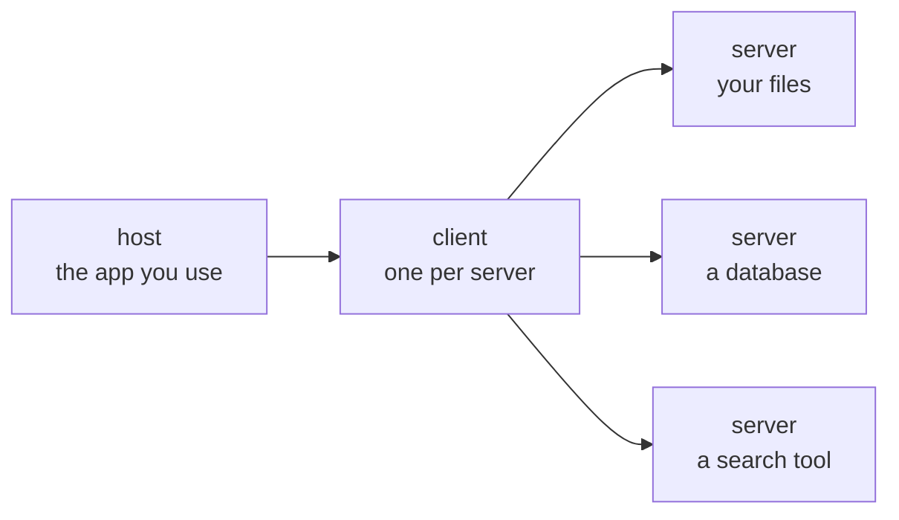

# Chapter 12 — Extension

### Reaching outside the session

Chapter 6 drew a trust boundary. This chapter is the room opening it on purpose,
knowing what it costs.

<!--
- **Says:** Opens the chapter by naming reaching outside the session as its subject, framing it as the room reopening Chapter 6's trust boundary on purpose.
- **From:** Follows Chapter 11's orchestration content, moving from delegating work within a session to reaching for capability outside it entirely.
- **Chapter:** Serves as the chapter's framing slide, opening the trust-boundary thread's next stage before any protocol mechanics appear.
- **To:** Leads into the slide naming the integration problem a protocol like MCP solves.
-->

---

## The problem a protocol solves

<v-clicks>

- Every tool you might connect — a database, a document store, a second provider — has its own interface.
- Without a common protocol that is N tools times M clients of bespoke integration, and none of it is reusable.
- A protocol collapses that to N plus M. That is the entire motivation, and it is the same argument as any other interface standard you have met.

</v-clicks>

<!--
- **Says:** States the N-tools-by-M-clients integration problem and how a shared protocol collapses it to N plus M.
- **From:** Follows the title slide's framing of "reaching outside the session" with the concrete problem that motivates a protocol.
- **Chapter:** Lays the motivating argument before the chapter names MCP's own architecture.
- **To:** Leads into the slide naming the protocol's three architectural roles.
-->

---

## Host, client, server

<v-clicks>

- The **server** exposes capability. It is usually small and often something you can write.
- The **client** speaks the protocol. You do not write it.
- The **host** is the application you are already using.

</v-clicks>

<!--
- **Says:** Defines host, client and server as the three roles in the protocol, illustrated with a flowchart.
- **From:** Follows the protocol-motivation slide by naming the concrete pieces that implement the N-plus-M argument just made.
- **Chapter:** Delivers the chapter's core architecture vocabulary for everything that follows.
- **To:** Leads into the slide on what a server can actually expose.
-->

---

## Three things a server can expose

<v-clicks>

- **Tools** — actions the model may call. This is the one with consequences.
- **Resources** — data the model may read. Files, records, documents.
- **Prompts** — reusable prompt templates the server offers to the host.
- The spec also lets *clients* offer features back to servers — sampling, roots, elicitation. Out of scope here; know they exist.

</v-clicks>

Keep the first two distinct in your head. A tool **does** something; a resource is
something read. Chapter 6's whole failure mode is content from the second class being
treated as an instruction from the first.

**The protocol says this itself.** Tools "represent arbitrary code execution and must be
treated with appropriate caution", and tool descriptions "should be considered untrusted,
unless obtained from a trusted server." The threat model is in the specification, not
bolted on by this course.

<Cite k="mcp-spec" />

<!--
- **Says:** Names tools, resources and prompts as what a server exposes, then quotes the protocol specification's own warning about tool risk.
- **From:** Follows the host/client/server slide by detailing what actually passes through the server role just defined.
- **Chapter:** Ties the tools-versus-resources distinction to Chapter 6's injection failure mode, continuing the trust-boundary thread into the protocol's own vocabulary.
- **To:** Leads into the codebase-and-document-graphing slide, the chapter's first worked application of a server.
-->

---

## Graphing a codebase or a document set

<v-clicks>

- Build a local, queryable map of code, documents and PDFs, and then ask questions of the map instead of reading files one at a time.
- Edges are labelled by how they were obtained: **extracted** from the syntax tree, or **inferred**. Those are not the same evidence and the map says which.
- Commit the map so the group shares one picture rather than six.

</v-clicks>

**Two cautions that belong together.** Pin the version of a fast-moving dependency, or the
map you commit today is not the map you rebuild next month. And the **semantic pass over
documents leaves the machine while the code pass does not** — which makes it a Chapter 18
data-governance question, not a convenience question.

That split was confirmed by running it: on version 0.9.16 the document pass refuses without
an external API key, and the code pass runs on a local syntax tree without one. **It is a
version-pinned observation, not a documented guarantee** — re-check it on upgrade, because
Chapter 18 routes an NDA decision through it.

<Cite k="graphify" />

<!--
- **Says:** Describes building a local, queryable map of code and documents, distinguishing extracted from inferred edges, and flags version-pinning and data-governance cautions.
- **From:** Follows the tools/resources/prompts slide with a concrete instance of a server capability in use.
- **Chapter:** Illustrates one of the chapter's voluntarily opened channels and previews the Chapter 18 data-governance question the trust-boundary thread closes on.
- **To:** Leads into the cross-provider retrieval slide, the chapter's second worked application.
-->

---

## Cross-provider retrieval: a licensing asymmetry

Different providers hold different content licences. A second provider reachable from
the same session can retrieve sources the first is not licensed to return.

<v-clicks>

- Taught as **a licensing asymmetry with a provenance obligation**. Not as circumvention, and not as a trick.
- **Onward use may exceed the retrieving provider's terms.** Retrieval is not a licence to republish.
- **Source quality still has to be judged.** A second provider is not a second opinion.
- **Record the retrieval chain.** Which provider returned what, and when. Chapter 14 will require the identifier anyway.

</v-clicks>

Framed as circumvention this would be both wrong and fragile. Framed as an asymmetry with
an obligation attached, it survives a question from a librarian.

<!--
- **Says:** Frames retrieving sources through a second provider as a licensing asymmetry with a provenance obligation, not as circumvention.
- **From:** Follows the codebase-graphing slide with the chapter's second example of a deliberately opened channel.
- **Chapter:** Extends the trust-boundary thread as a licensing asymmetry rather than the circumvention Chapter 6's threat model might suggest.
- **To:** Leads into the slide that names the trust-boundary thread explicitly.
-->

---

## Trust boundary, reopened

<v-clicks>

- Chapter 6: untrusted content entering the window is treated as instruction, and there is no complete defence.
- This chapter: you are now connecting servers that fetch content you did not write, on purpose, because it is useful.
- **Nothing about the threat changed. What changed is that you chose it.**

</v-clicks>

**Thread — trust boundary.** Introduced Chapter 2 as trained behaviour, attacked in
Chapter 6, opened voluntarily here, and governed in Chapter 18.

<!--
- **Says:** States plainly that nothing about the Chapter 6 threat changed here except that the room now chooses to open the channel.
- **From:** Follows the two worked examples by naming the thread they both belong to.
- **Chapter:** Carries the chapter's explicit trust-boundary thread marker, tracing its arc from Chapter 2 through Chapter 6 to here and forward to Chapter 18.
- **To:** Leads into the hands-on slide, where the chapter would put this choice into practice.
-->

---

## Hands-on

**BLOCKED — needs the working Antigravity configuration.**

This chapter cannot be finished until the group's Gemini access path is documented:
what is actually invoked, and how results come back. See `DECISIONS.md` item 2.

The preceding slides state the **mechanism**, which stands. But the cross-provider slide's
central factual claim — that a second provider is reachable from this session and returns
sources the first cannot — is **exactly what the missing configuration would establish**, so
it is unverified until then. The hands-on exercise depends on it entirely.

The exercise, once unblocked: connect one server, list what it exposes, call one tool,
read one resource, and record where the data went.

<!--
- **Says:** States that the hands-on exercise is BLOCKED pending the working Antigravity configuration referenced in DECISIONS.md item 2.
- **From:** Follows the trust-boundary slide by attempting to turn its mechanism into a hands-on exercise.
- **Chapter:** Marks the chapter's exercise as unresolved rather than describing an exercise that does not currently run.
- **To:** Leads into the closing summary slide regardless of the block.
-->

---

## Where this leaves us

<v-clicks>

- A protocol, so a tool written once is reachable from anything that speaks it.
- Three server primitives, and the distinction between the one that **acts** and the one that is **read** — which is Chapter 6's failure mode restated as an interface.
- A map of your own code and documents, with the local and the remote halves told apart.
- A retrieval asymmetry you may use, with an obligation attached rather than a trick.

</v-clicks>

Every channel in this chapter was opened deliberately. **Chapter 13 is what it costs to
keep them open** — and Chapter 18 is who answers for what went through them.

<!--
- **Says:** Summarises the chapter's four takeaways: the protocol, the tools-versus-resources distinction, the codebase map, and the retrieval asymmetry.
- **From:** Follows the blocked hands-on slide by closing out the chapter's content regardless.
- **Chapter:** Closes Chapter 12 by naming what the next two chapters do with what was opened here.
- **To:** Hands off to Chapter 13 — Access, on what it costs to keep these channels open.
-->
