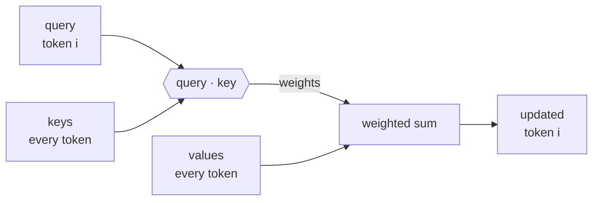

# Chapter 1 — Substrate

### What the system computes

Everything in this course rests on one operation. This chapter is that operation,
and nothing else.

---

## The question this chapter opens and will not answer

**Is this like a brain?**

<v-clicks>

- Hold it. It is the wrong question to answer first.
- Chapter 8 returns to it — after we have priced the thing and watched it fail.
- The answer is more interesting once you know what it actually computes.

</v-clicks>

---

## Tokens are not words

The model does not see characters, and it does not see words. It sees **tokens** —
fragments drawn from a fixed vocabulary fixed before training ever started.

<v-clicks>

- Common English collapses into few tokens. `the` is one.
- Technical terminology fragments. Your field's vocabulary is not in that vocabulary.
- A term you use fifty times a day may cost four tokens every time.

</v-clicks>

**TODO(capture)** — tokeniser screenshots: one MATLAB snippet, one abstract from
mechanics, concrete or fluids. Capture as images so the demo survives dead wifi.
No tokeniser is installed on the authoring machine and token boundaries are not
guessed here.

---

## Why that matters to you specifically

<v-clicks>

- Tokens are the unit you are billed in, the unit the context window is measured in, and the unit throughput is quoted in.
- A dense technical paragraph costs more than a chatty one of the same length.
- The vocabulary was fixed by what was common on the internet, not by what is common in your field.

</v-clicks>

**Thread opened — cost.** The token is the unit of *meaning* here. In Chapter 7 it
becomes the unit of *price*, and in Chapter 13 the unit of *billing*.

---

## The entire objective

Given a sequence of tokens, predict the next one.

<v-clicks>

- That is all of it. There is no second objective bolted on underneath.
- Everything the system appears to do — answer, summarise, refuse, write code — is that operation repeated, each output token appended and fed back in.
- No goal. No plan. No model of you. One conditional distribution at a time.

</v-clicks>

How a next-token predictor started behaving like an assistant is **Chapter 2**, and
it is not an accident of scale.

---

## It does not return an answer

It returns a **probability distribution over the entire vocabulary** — every token,
every time.

<v-clicks>

- Something downstream then has to pick one.
- That picking is a separate, tunable step. It is not part of the model.
- This is where temperature lives, and it is why the same prompt gives different answers.

</v-clicks>

---

## The same distribution, reshaped

The logit values are illustrative — they are not measured from any model. The
softmax applied to them is exact, and the reshaping is the point.

---

## Why it is called *temperature*

$$p_i \;=\; \frac{\exp\!\left(z_i / T\right)}{\sum_j \exp\!\left(z_j / T\right)}$$

$z_i$ — logit for token $i$, dimensionless. $T$ — temperature, dimensionless.
$p_i$ — probability, dimensionless, $\sum_i p_i = 1$.

<v-clicks>

- This is the Boltzmann distribution, $p_i \propto \exp(-E_i / k_\mathrm{B}T)$, under the identification $z_i = -E_i / k_\mathrm{B}$.
- Low $T$: the system settles into its lowest-energy state. High $T$: it explores.
- The name is not a metaphor or a borrowed intuition. It is the same equation you already know.

</v-clicks>

---

## Consequence: it is not reproducible by default

One prompt. Five runs. Five different answers.

<v-clicks>

- This is not a fault. It is the sampler doing exactly what it is for.
- It is also why *"it worked when I tried it"* is not evidence, and why a prompting claim needs an eval rather than an anecdote.

</v-clicks>

**TODO(capture)** — temperature demo: one prompt, five runs, five answers, recorded
with the model ID and date beside them.

**Forward reference — Chapter 4.** Run-to-run variation is the noise floor every
prompting comparison has to clear.

---

## The context window is a bounded buffer

Everything the model can condition on sits in one window: your prompt, the files you
pasted, the conversation so far, the system instructions you never see.

<v-clicks>

- Fixed size. Nothing outside it exists for the model.
- It is not storage. It is not a database. It is the input to one forward pass.
- Filling it is not free, and Chapter 7 shows what it costs.

</v-clicks>

**Thread opened — memory and context.** Introduced here as a bounded buffer.
Chapter 5 shows it degrading, Chapter 8 names what is missing, Chapter 10 builds
the replacement.

---

## Nothing persists

<v-clicks>

- Between sessions, nothing is retained. The weights are frozen at training time and do not change because you talked to it.
- The window is discarded when the session ends.
- When a tool appears to *remember* your project, something outside the model re-inserted that text into the window. That mechanism is Chapter 10, and it is yours to build.

</v-clicks>

---

## The KV cache

Generating each new token would mean recomputing the whole sequence. Instead the
intermediate results for each token are cached and reused.

The cache grows **linearly with context length**. The weights do not grow at all.
Axes are normalised to the weight term — the linearity is the claim, not the slope.

<Cite k="pope2026" />

---

## Attention, in one sentence

Each token's representation is updated as a **weighted sum over the other tokens**,
where the weights come from how well a query matches each key.

It shares a name with neural attention and, as Chapter 8 argues, little else.

<Cite k="vaswani2017" />

---

## What this chapter deliberately omits

<v-clicks>

- **Positional encoding** — how the model knows token order
- **Multi-head attention** — several attention operations in parallel
- **Layer normalisation** — numerical stability between layers

</v-clicks>

Not because they are unimportant. Because knowing them would not change one decision
you make this week, and the time is better spent on the hands-on work.

**Saying what a course leaves out is part of the course.** You will want the same
habit when a model gives you an answer with no stated scope.

---

## Where this leaves us

<v-clicks>

- A next-token predictor. One conditional distribution at a time, sampled.
- A bounded window that is discarded, and a cache inside it that grows with the window.
- Two threads now open: **cost**, and **memory and context**.

</v-clicks>

And the question we did not answer: **is this like a brain?**

Chapter 8, once it is worth answering.

