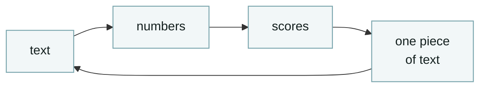
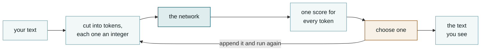
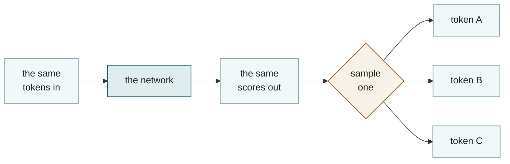
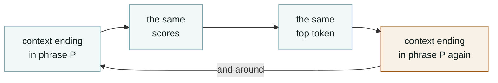
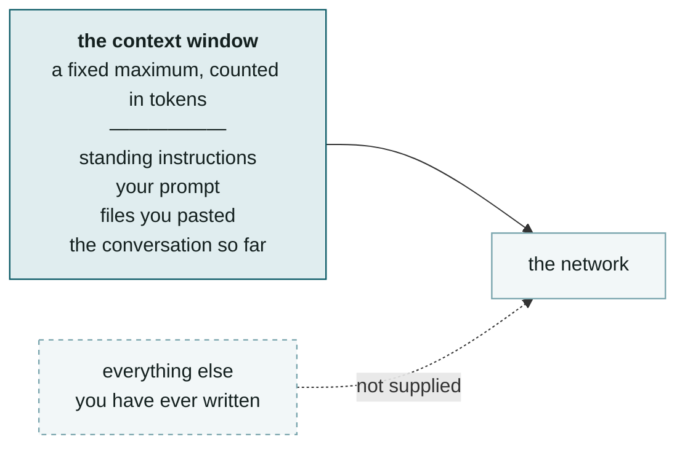
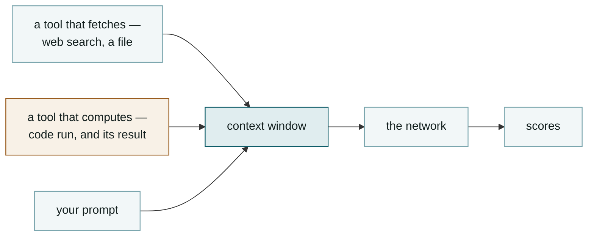
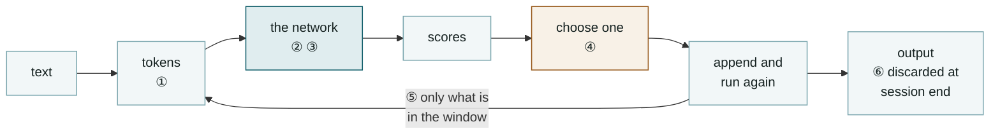

# Chapter 1 — Substrate

### What a language model is, and what one run of it computes

Nothing in this chapter assumes you have seen any of it before.

<!--
- **Says:** Names the chapter and the two questions it answers — what the object is, and what one run of it computes — and shows the loop it will spend the chapter unpacking.
- **From:** Opens the course. Nothing precedes it.
- **Chapter:** Sets the promise that the chapter starts from zero, which is the standard the previous two versions failed.
- **To:** Leads into the one thing everybody in the room has already seen.
-->

---

## The answer arrives a piece at a time

**You type**
a question — the text you send is the **prompt**

**It writes**
left to right, in pieces

**This chapter**
what each piece costs to produce

<!--
- **Says:** Starts from the one observation every attendee has already made — the reply is written progressively rather than delivered whole — and names it as the thing the chapter explains.
- **From:** Follows the title by grounding the chapter in an artefact the room owns rather than in an abstraction.
- **Chapter:** The piece-at-a-time observation is the loop, seen from outside. Everything after this explains one pass of it.
- **To:** Leads into naming what the thing producing those pieces actually is, starting with the word people use for it.
- **Caveat to say aloud:** some interfaces buffer and show the reply in one go. The pieces are still produced one at a time; the display is what differs.
-->

---

## Artificial intelligence names a family of methods, and language models are one branch of it

**Large language model** — a neural network fitted to predict text. Shortened to **LLM**.

<!--
- **Says:** Places language models inside machine learning inside artificial intelligence, and gives each outer band an example of something in it that is not a language model.
- **From:** Follows the artefact by naming the category the artefact belongs to, which the previous versions of this course never did.
- **Chapter:** Answers "is all AI an LLM?" — no. The rest of the course is about the innermost band only, and saying that bounds every claim made afterwards.
- **To:** Leads into what a model is as an object, now that its category is fixed.
- **Say aloud:** artificial intelligence has no single technical definition. It is a label applied to whatever currently looks like intelligent behaviour, and what sits under it has changed several times.
- **Caveat:** not every language model is a neural network — word-frequency models predate them. Every model in this course is.
-->

---

## A model is a long list of numbers together with the program that does arithmetic with them

**Parameters**
also called **weights**

**Network**
the layered arithmetic

**Size**
how many parameters

<!--
- **Says:** Defines a model as a concrete artefact — a stored list of numbers plus the program that evaluates them — and names the three terms the rest of the course uses for its parts.
- **From:** Follows the taxonomy slide by making the innermost band into an object you could copy onto a disk.
- **Chapter:** The previous versions of this course never gave this definition. Every later claim about determinism, cost and memory is a claim about these two files.
- **To:** Leads into where the numbers came from.
- **Say aloud:** the framing of a model as two files is Karpathy's. It costs one slide and it fixes the thing the course was faulted for skipping.
- **Do not say:** a specific file size or parameter count. Those are per-model claims and none is cited here.
-->

---

## Training set those numbers and then stopped

**Training**
the numbers are being changed

**Inference**
running the finished numbers on your text

**Knowledge cutoff**
the date training stopped

Everything you will ever do with it happens to the right of the line. One **session** is one continuous conversation, from opening it to closing it.

<!--
- **Says:** Separates the phase in which the parameters change from the phase in which they are only read, and names them training and inference.
- **From:** Follows the definition of a model by answering where the numbers came from.
- **Chapter:** Fixes the two facts the rest of Session 1 leans on: the knowledge cutoff is a consequence of training having ended, and nothing a user does alters the parameters.
- **To:** Leads into what training actually did, using a procedure this room has already run.
- **Say aloud:** the date training stopped is the knowledge cutoff. It is a consequence of the process, not a policy decision about what to withhold.
- **Caveat:** models do get retrained and replaced. A given model's numbers never change; the model you are pointed at can.
-->

---

## Training chooses parameter values that make the total error smallest

**Two parameters**
slope and intercept

**One error**
summed over the data

**One search**
for the values at the minimum

<!--
- **Says:** Gives training as curve fitting, using a procedure the audience has run many times, and shows the error surface whose minimum training searches for.
- **From:** Follows the training-and-inference split by explaining what "the numbers are being changed" means mechanically.
- **Chapter:** The discipline bridge sits here. A model is a parameterised function fitted to data by minimising an error, which is a sentence this room can already check.
- **To:** Leads into the whole data path, now that both the object and its origin are defined.
- **Say aloud:** the differences from curve fitting are the number of parameters, the fact that the error is measured on text, and that the search is iterative rather than closed-form. The procedure is the same one.
- **Caveat:** the right-hand panel varies one parameter. A real training run searches a space with billions of dimensions, and the picture of a single bowl is a one-dimensional slice of it.
-->

---

## Neural network and learning are borrowed names for a search over numbers

**Neural network**
layers of multiply-and-add, named after a biological analogy

**Learning**
a search for values that lower the error

**The brain comparison**
correlational; the appendix carries what it establishes

<Cite k="schrimpf2021,hadidi2026" />

<!--
- **Says:** States what training did in physical terms — numbers moved from random starting values — and gives the two biological words the audience has just met as names rather than as claims.
- **From:** Follows the fitting slide, which is the moment the room will reach for the brain analogy, because they have just been told the thing is a neural network that learns.
- **Chapter:** Answers "is it like a brain?" once, at the point of maximum need, and closes it. The question is not held open for eight chapters, and no later chapter has to unteach an analogy this course taught.
- **To:** Leads into the whole data path, with the vocabulary now settled.
- **Say aloud:** the numbers started as noise. Whatever the system does, it acquired it by a search over those numbers against a measure of error, and that is the whole of what training is.
- **The brain-comparison line, said in full rather than printed:** a real literature compares what happens inside the network against recordings of brain activity. The results are correlational, the headline figure is divided by a ceiling estimated from how noisy the recordings are, and one of the original authors co-wrote a re-analysis of it.
- **The three facts behind that, if pressed:** the encoding-model work reports predictivity normalised by noise ceilings of 0.32, 0.17 and 0.20 across its three datasets; the predictive-processing conclusion is a between-model correlation rather than something measured inside a brain; and Idan Blank is a co-author of both the original paper and the later re-analysis. That last one is what a healthy field looks like from outside.
- **Do not say:** that the comparison has been refuted. It has been qualified by its own authors, which is a different and more useful thing.
- **Where the rest went:** `slides/08-brain-and-model.md` is now the appendix deck rather than a delivered chapter. It is distributed, not presented. See `DECISIONS.md`.
-->

---

## The whole path runs from text to numbers to scores to one piece of text, and then repeats

**Token** — a chunk of characters from a fixed list, defined on the next slide. Every box here gets its own slide.

<!--
- **Says:** Gives the entire data path as one diagram before any stage is explained, and glosses the one term on it that has not yet been defined.
- **From:** Follows the training slide, which finished the account of the object. This begins the account of what one run of it does.
- **Chapter:** The map. Every later slide expands exactly one box, so a detail always has somewhere to attach.
- **To:** Leads into the first box that needs a definition rather than a name.
- **Say aloud:** the preview-then-zoom order is 3Blue1Brown's, and it is the structural answer to a room holding both beginners and people who already know some of this. Beginners get the map; anyone ahead can see where the depth is coming.
- **Point out:** the arrow labelled "run again" is the whole reason the answer arrives a piece at a time.
-->

---

## A token is a chunk of characters drawn from a fixed list that was settled before training

**Fixed list**
the **vocabulary** — tens of thousands of entries

**Roughly 3–4 characters**
each, in English

**The network sees integers**
never letters

<!--
- **Says:** Defines a token positively as an entry in a fixed list of character chunks, shows one sentence split into them, and states that the network is handed integers rather than text.
- **From:** Follows the pipeline preview by defining its second box, which the preview deliberately deferred.
- **Chapter:** Supplies the unit that every later statement about cost, context length and billing is measured in.
- **To:** Leads into what that splitting costs this audience specifically.
- **Say aloud:** the list is built before training and does not change afterwards. A word not in the list is split into pieces that are, which is why a model can produce words nobody ever wrote down.
- **TODO(capture):** run a real tokeniser on this sentence and on a MATLAB snippet, screenshot both, and replace the schematic. The figure says SCHEMATIC on its face until that is done.
- **Do not say:** a specific vocabulary size. "Tens of thousands" is safe; a number is a per-model claim and none is cited here.
-->

---

## Technical terms are split into more tokens than common words

**Billed**
per token

**Context limit**
counted in tokens

**Speed**
quoted per token

<!--
- **Says:** Shows that the vocabulary this audience writes in splits into more tokens than everyday English, and names the three places that costs them.
- **From:** Follows the token definition with the consequence that makes the definition worth having.
- **Chapter:** Turns an abstract unit into a quantity the room pays for, which is the cost thread's first appearance. Chapter 7 prices it and Chapter 13 bills it.
- **To:** Leads into what the network does once it holds the integers.
- **Say aloud:** the practical effect is that a page of your writing costs more tokens than a page of a newspaper. Nothing is wrong when that happens.
- **TODO(capture):** the bars are schematic. Run the tokeniser on the group's own vocabulary and replace them.
-->

---

## The network returns one score for every token in the list, because scoring is the only operation it performs

The raw scores are called **logits**. A higher score means the token fits the text so far better, according to the fitted numbers. One run of the network over the window is one **pass**.

<!--
- **Says:** Establishes that the network emits one number per entry in the token list, names those numbers logits, and gives the reason the output takes that shape.
- **From:** Follows the token-cost slide by moving to the next box of the pipeline.
- **Chapter:** Introduces logits, without which softmax and temperature two slides later are arbitrary.
- **To:** Leads into how a score for the next token can depend on words that appeared much earlier.
- **The reason, said aloud, because it is the point of the headline:** the program is a fixed sequence of multiplications and additions. It has no step that decides on an answer and writes it out. The only thing it can produce is numbers, so the answer has to be assembled from what those numbers rank.
- **Note:** the values are illustrative and the figure says so. The softmax applied to them is exact.
-->

---

## Attention is the weighted sum that decides which earlier tokens the next score leans on

The paper defines it as a **weighted sum**, in which the weight on each earlier position is computed by comparing that position against the one being scored. **Transformer** is the name given to the arrangement of arithmetic built out of that operation. The word is borrowed from biology as well, and the paper that introduced the operation is about machine translation.

<Cite k="vaswani2017" />

<!--
- **Says:** Defines attention as a weighted sum whose weights are computed from the text, and names the architecture built from it.
- **From:** Follows the scoring slide by answering the obvious question — how a score for the next token can depend on a word twenty tokens back.
- **Chapter:** Two words the room will hear constantly are defined here, once, in the place the argument needs them. Chapter 8 relies on this definition when it separates the operation from the neuroscience term it borrowed its name from.
- **To:** Leads into turning the scores into something that can be sampled.
- **The paper's exact wording, if anyone asks for it:** attention maps "a query and a set of key-value pairs to an output", computed as "a weighted sum of the values, where the weight assigned to each value is computed by a compatibility function of the query with the corresponding key." Those three role names are kept off the slide on purpose — the course never uses them again, and naming them would leave three terms undefined to save nothing.
- **Scope, and say it:** this is one sentence and one diagram. How the weights are computed, how many attention operations run in parallel, and how position is encoded are all excluded, because none of them changes a decision anyone here will make.
- **Caveat:** the arc thicknesses are drawn to show the operation. They were not extracted from a model, and the figure says so.
-->

---

## Softmax converts the scores into probabilities that add up to one

$$p_i \;=\; \frac{\exp\!\big(\overbrace{z_i}^{\text{score for token }i}\big/\underbrace{T}_{\text{temperature}}\big)}{\underbrace{\sum_j \exp(z_j/T)}_{\text{sum over every token, so the result adds to }1}}$$

**Worked case — two tokens, scores 2.0 and 1.0, at $T=1$**

$$p_1 = \frac{e^{2.0}}{e^{2.0}+e^{1.0}} = \frac{7.389}{7.389+2.718} = 0.731$$

All quantities dimensionless. $z$ and $T$ carry no units, and $p$ is a probability.

<!--
- **Says:** Gives the softmax formula with every symbol annotated on the equation itself, one worked case with the arithmetic shown, and the same case swept across temperature.
- **From:** Follows the scoring slide by converting raw scores into quantities that can be sampled from.
- **Chapter:** The only equation in the chapter, and the one the room can check by hand in ten seconds.
- **To:** Leads into what changing T does across a whole vocabulary rather than two tokens.
- **Check the arithmetic aloud if asked:** e^2 = 7.389, e^1 = 2.718, sum 10.107, ratio 0.731. The three marked points on the figure are 0.881 at T = 0.5, 0.731 at T = 1.0 and 0.622 at T = 2.0, all computed by the committed script rather than typed.
- **Worth naming:** the form is the Boltzmann distribution with the score standing in for negative energy over kT. Several people in the room will recognise it.
-->

---

## Temperature sets how sharply the highest score wins

**Low T**
one token takes almost all the probability

**T = 1**
the scores are used as they are

**High T**
the probability spreads across many tokens

<!--
- **Says:** Shows one score vector rendered as probabilities at four temperatures, so the sharpening is visible rather than asserted.
- **From:** Follows the two-token worked case by scaling the same effect to a full vocabulary.
- **Chapter:** Completes the selection stage of the pipeline diagram.
- **To:** Leads into the consequence the room has already met without having a name for it.
- **Say aloud:** temperature is a setting on the sampler, applied after the network has finished. It changes nothing inside the network.
- **Caveat:** the logits in the figure are illustrative and the transform applied to them is exact, which is stated on the figure.
-->

---

## Two runs of the same prompt give the same scores and can still give different answers

**The network**
fixed numbers, fixed arithmetic, one answer

**The sampler**
draws from the probabilities, so it can land elsewhere

<!--
- **Says:** Locates the run-to-run variation in the sampling step rather than in the network, and shows the two stages separately.
- **From:** Follows the temperature slide by applying it to something the room has already experienced and had no explanation for.
- **Chapter:** Makes variation predictable instead of mysterious, and sets up Chapter 4, where the spread has to be measured before any prompt comparison means anything.
- **To:** Leads into what happens after one token has been chosen.
- **Say aloud:** setting temperature to zero takes the top-scoring token every time and removes this variation. Chapter 4 uses that, and the next slide but one shows what it costs.
- **Honest caveat:** identical scores assume identical input and the same model version. On a hosted service, the hardware and the way requests are grouped on the server can perturb the arithmetic slightly. The variation you actually see is dominated by the sampler.
- **TODO(capture):** one prompt, five runs, five answers, recorded with the model ID and the date.
-->

---

## Each chosen token is appended and the whole program runs again on the longer text

Four passes here, four scores over the whole token list, four choices. A paragraph is a few hundred of these.

<!--
- **Says:** Unrolls the loop over four passes, showing that the parameters are re-read each time and only the input has grown.
- **From:** Follows the sampling slide by showing what happens to the token once it has been chosen.
- **Chapter:** Closes the loop the title slide opened, and explains the piece-at-a-time observation from slide two.
- **To:** Leads into what happens when the choice is made in the simplest possible way.
- **Say aloud:** every pass costs the same arithmetic. This is why output length and price track each other, which Chapter 7 derives and Chapter 13 bills.
- **Caveat:** the distributions are drawn, not measured, and the figure says so.
- **Worth adding:** generation cannot be parallelised across positions, because pass four needs the token that pass three produced. Training can be, which is why training a model is fast relative to the text it has read and generation is not.
-->

---

## Taking the highest-scoring token every time makes the text fall into a loop

Taking the top-scoring token every time is called **greedy** selection. Same numbers, same input, same output — so once a phrase recurs, the context that produced it recurs with it, and the top-scoring token is the same one again.

<!--
- **Says:** Derives repetition under greedy selection from determinism, which the chapter established two slides ago, rather than asserting it as an observed quirk.
- **From:** Follows the loop slide by asking what the simplest possible selection rule does.
- **Chapter:** The objective is shown breaking here. Stating what the model optimises and then showing it fail is the move every reviewed explainer uses, and it is what stops next-token prediction sounding either trivial or magical.
- **To:** Leads into the limit on what the scores can depend on at all.
- **Say aloud:** the reason sampling exists is here. Randomness is not decoration on the output; without it the simplest rule produces text that repeats.
- **TODO(capture):** the same prompt at temperature zero, run long enough to show the repetition, with the model ID and the date. Do not describe the effect without the recording.
- **Attribution for the teaching move:** Wolfram states the objective plainly and then shows greedy selection producing flat repetitive text. The structure is his.
-->

---

## The network is given the tokens in the context window and nothing else

The window is the input to one pass. It holds tokens, it has a maximum size, and it is re-read in full on every pass. **Standing instructions** are text placed in the window at the start of every session, which Chapter 10 is about.

<!--
- **Says:** Bounds what the scores can be conditioned on: the tokens currently in the window, up to a fixed maximum, and nothing outside it.
- **From:** Follows the loop slide by asking what the growing text is actually competing for.
- **Chapter:** Introduces the bound that Chapter 5 measures the accuracy cost of and Chapter 7 prices.
- **To:** Leads into how material reaches the window from outside.
- **Say aloud:** the window is neither storage nor a database. It is an input buffer, and its contents are supplied fresh on every pass.
- **Do not say:** a specific maximum. Window sizes are per-model and per-plan, they change, and none is cited here. Chapter 7 handles the size question with an equation.
-->

---

## Tools add text to the window and can run code beside the network, and the scoring step is unchanged

A **tool** is a program the system can run alongside the network. It fetches or computes, its result is written into the window as tokens, and the pass that follows is the one already described.

<!--
- **Says:** Corrects two over-simplifications at once — that the model never looks anything up, and that every number it reports was predicted rather than computed — by showing tools as separate stages that write into the window.
- **From:** Follows the context-window slide by answering the obvious objection that the tool plainly does search the web.
- **Chapter:** Keeps the chapter's central claim true of the product in the room rather than only of the network, and sets up Chapters 12 and 14.
- **To:** Leads into what happens to the window at the end of a session.
- **Say aloud, because Chapter 5 depends on it:** whether arithmetic was predicted or computed depends on whether a code tool ran. The vendor documents the routing: code runs for large or precision-sensitive calculations, and the model answers directly for simple arithmetic and simple unit conversions. The transcript shows which happened, so it is a check you can run.
- **Version-fragile:** which tools are available and when they fire changes between releases. Re-check in the week before delivery, per DECISIONS.md item 6.
-->

---

## The window is discarded when the session ends and the numbers are left as they were

**Discarded**
the window, the conversation, anything you pasted

**Unchanged**
the parameters, in every session

When the system appears to remember your project, something outside the network put that text back into the window.

<!--
- **Says:** States that the window is discarded at session end and that use leaves the parameters untouched.
- **From:** Follows the tools slide by completing the lifecycle of the window.
- **Chapter:** Closes the last box of the pipeline and sets the gap that Chapter 10 exists to fill with a file you write.
- **To:** Leads into the chapter summary.
- **Say aloud:** talking to it teaches it nothing. Anything that looks like memory is a file being read back into the window at the start of the next session, and Chapter 10 is where you write that file.
- **Caveat:** providers may retain transcripts for their own purposes, which is a data-governance question rather than a memory one. Chapter 18 handles it.
-->

---

## Six facts, and where each one is used later

| | | Used in |
|---|---|---|
| ① | Text is cut into **tokens** from a fixed list | Ch 7 cost, Ch 13 billing |
| ② | The **parameters** were fixed by training and are only read | Ch 2 formation, Ch 10 memory |
| ③ | The network returns **one score per token**, every pass | Ch 5 hallucination |
| ④ | The scores are fixed; the **choice among them** is sampled | Ch 4 measurement |
| ⑤ | It conditions only on the **context window** | Ch 5 degradation, Ch 6 injection |
| ⑥ | The window is **discarded** at the end of the session | Ch 9, Ch 10 |

<!--
- **Says:** Collects the chapter into six numbered facts pinned to the stages of the pipeline, and names the chapter where each one is spent.
- **From:** Follows the persistence slide by assembling everything the chapter established.
- **Chapter:** The takeaway for anyone attending only this session, and the content of the reference card.
- **To:** Hands off to Chapter 2.
- **Say aloud as the transition:** everything here describes something that scores text fragments. Nothing in scoring text fragments produces a thing that answers your question, follows an instruction, or declines a request. Chapter 2 is what was added on top, and who added it.
- **Excluded from this chapter, and say so if asked:** how attention weights are computed, positional encoding, multi-head attention, and the KV cache. The first three change no decision anyone here will make. The KV cache is defined in Chapter 7, at the point where it is priced.
-->
