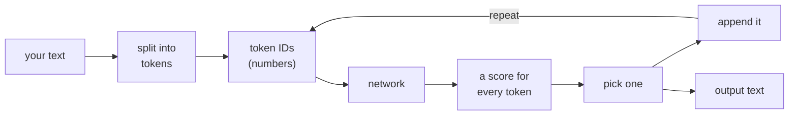
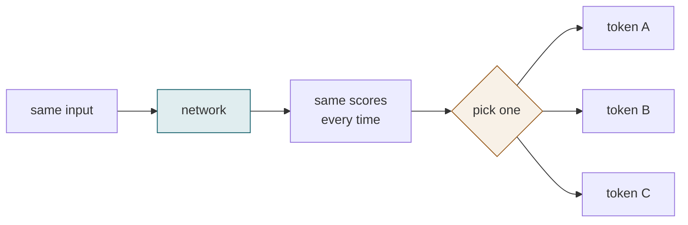
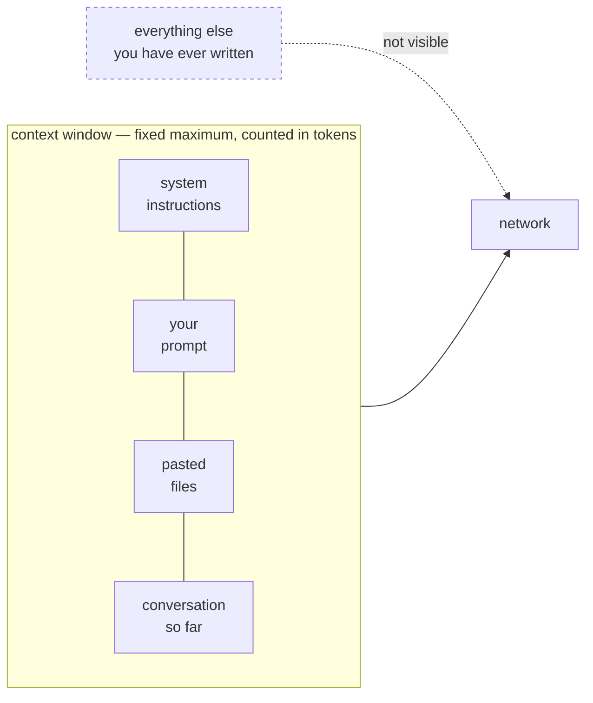
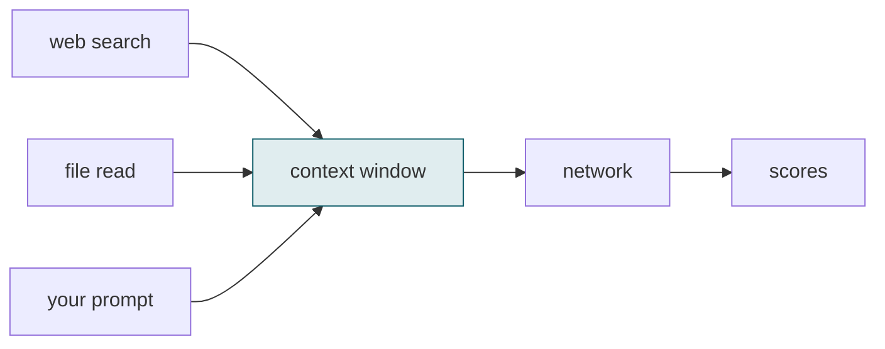

# Chapter 1 — Substrate

### What the model does

One operation, five facts, and a diagram you will see again in every later chapter.

<!--
- **Says:** Opens the chapter on its single operation without naming it yet, and sets the expectation of five facts and a recurring diagram.
- **From:** Opens the course; nothing precedes it.
- **Chapter:** Frames the chapter as a mechanism chapter rather than a survey.
- **To:** Leads into the pipeline diagram that carries the whole chapter.
-->

---

## The model turns text into tokens, scores every possible next token, picks one, and repeats

Every box is covered in this chapter. The loop is the whole mechanism.

<!--
- **Says:** Gives the full pipeline as one diagram: text, tokens, IDs, network, scores, selection, append, repeat.
- **From:** Follows the title slide by immediately showing the operation it promised.
- **Chapter:** This is the chapter's spine; every later slide expands one box of it.
- **To:** Leads into the first box that needs defining, the token.
-->

---

## A token is a chunk of characters from a fixed vocabulary

- Fixed **before** training
- Typically 3–4 characters in English
- The model never sees letters
- It sees **token IDs** — integers

Roughly 50,000–100,000 tokens in a typical vocabulary.

Anything not in it gets split into pieces that are.

**TODO(capture)** — run a real tokeniser on one sentence and screenshot the split.

<!--
- **Says:** Defines a token positively: a fixed-vocabulary chunk of characters, fixed before training, represented to the model as an integer ID.
- **From:** Follows the pipeline diagram by defining its second box.
- **Chapter:** Supplies the unit that every later cost, context and billing claim is measured in.
- **To:** Leads into what token splitting costs the audience specifically.
-->

---

## Technical terms cost more tokens than common words

**Billing**
per token

**Context limit**
counted in tokens

**Throughput**
quoted per token

<!--
- **Says:** Shows that technical vocabulary splits into more tokens than common words, and names the three places that costs the audience.
- **From:** Follows the token definition with its practical consequence.
- **Chapter:** Converts an abstract unit into something the audience pays for, which is why the definition mattered.
- **To:** Leads into what the network does once it has the token IDs.
-->

---

## The network outputs a score for every token in its vocabulary

Those raw scores are called **logits**. Higher score, more likely next token.

<!--
- **Says:** Establishes that the network emits one score per vocabulary token, names those scores logits, and shows them before and after normalisation.
- **From:** Follows the token-cost slide by moving to the next box of the pipeline, the network output.
- **Chapter:** Introduces logits, without which temperature two slides later is meaningless.
- **To:** Leads into where the randomness actually enters.
-->

---

## The network is deterministic — the randomness is added afterwards

**Deterministic**
Same input → same scores

**Probabilistic**
The pick, not the scores

<!--
- **Says:** Separates the deterministic network, which returns identical scores for identical input, from the probabilistic selection step that follows it.
- **From:** Follows the scores slide by answering where variation comes from, given that the scores are fixed.
- **Chapter:** This distinction is what makes temperature and run-to-run variation comprehensible rather than mysterious.
- **To:** Leads into the function that converts scores into the probabilities used for that pick.
-->

---

## Softmax converts scores into probabilities

$$p_i \;=\; \frac{\exp\!\big(\overbrace{z_i}^{\text{score for token }i}\big/\underbrace{T}_{\text{temperature}}\big)}{\underbrace{\sum_j \exp(z_j/T)}_{\text{sum over every token, so the result sums to }1}}$$

**Worked case — two tokens scoring 2.0 and 1.0**

| $T$ | $p$(first) | $p$(second) |
|---|---|---|
| 0.5 | 0.881 | 0.119 |
| 1.0 | 0.731 | 0.269 |
| 2.0 | 0.622 | 0.378 |

<!--
- **Says:** States the softmax formula with each symbol annotated on the equation itself, and works one two-token case at three temperatures.
- **From:** Follows the deterministic-probabilistic slide by giving the function that produces the probabilities being sampled from.
- **Chapter:** Supplies the only equation in the chapter, and the one the audience can check by hand.
- **To:** Leads into what changing T actually does across a full vocabulary.
-->

---

## Temperature controls how sharply the highest score wins

**Low T**
one token dominates

**T = 1**
scores used as-is

**High T**
choice spreads out

<!--
- **Says:** Shows the same score vector rendered as probabilities at four temperatures, with the sharpening effect visible across the panels.
- **From:** Follows the worked two-token case by scaling the same effect to a full vocabulary.
- **Chapter:** Completes the selection step of the pipeline diagram.
- **To:** Leads into the practical consequence the audience has already experienced.
-->

---

## The same prompt gives different answers because a token is sampled

**What you see**

- Same question, two runs
- Two different answers
- Neither is an error

**Why**

- Scores identical both times
- The pick differs
- $T = 0$ returns the top token every time

**TODO(capture)** — one prompt, five runs, five answers, recorded with the model ID and date.

<!--
- **Says:** Explains observed run-to-run variation as a consequence of sampling rather than of error, and notes that temperature zero removes it.
- **From:** Follows the temperature slide by applying it to something the room has already experienced.
- **Chapter:** Converts the mechanism into a prediction about the audience's own use.
- **To:** Leads into the limit on what the model can condition its scores on.
-->

---

## The model uses only the tokens inside its context window

Not storage. Not a database. It is the input to one forward pass.

<!--
- **Says:** Shows the context window as the complete and only input to the network, holding instructions, prompt, files and history up to a fixed token maximum.
- **From:** Follows the sampling slide by bounding what the scores can be conditioned on in the first place.
- **Chapter:** Introduces the bound that Chapters 5 and 7 later measure and price.
- **To:** Leads into how material gets into that window from outside.
-->

---

## Web search and file reading put text into the window — prediction is unchanged

The tool fetches. The window holds. The prediction step is identical either way.

<!--
- **Says:** Corrects the assumption that retrieval changes the mechanism, showing search and file reading as separate tools that write into the window before prediction runs unchanged.
- **From:** Follows the context-window slide by answering the obvious objection that the model can look things up.
- **Chapter:** Keeps the chapter's central claim accurate for tools that do retrieve, and sets up Chapters 12 and 14.
- **To:** Leads into what happens to that window when the session ends.
-->

---

## Nothing carries over when the session ends

**Discarded**

- The window
- The conversation
- Anything you pasted

**Unchanged**

- The weights
- Talking to it teaches it nothing

When a tool appears to remember your project, something outside the model put that text back into the window.

<!--
- **Says:** States that the window and conversation are discarded at session end and that the weights are unaffected by use.
- **From:** Follows the retrieval slide by closing out the window's lifecycle.
- **Chapter:** Completes the last box of the pipeline and sets the limit Chapter 10 exists to work around.
- **To:** Leads into the chapter summary.
-->

---

## Five facts

| | |
|---|---|
| 1 | Text is split into **tokens** from a fixed vocabulary |
| 2 | The network scores **every** token in that vocabulary |
| 3 | The network is **deterministic**; the pick is not |
| 4 | It conditions only on the **context window** |
| 5 | The window is **discarded** at the end of the session |

Everything in the next eighteen chapters is a consequence of these five.

<!--
- **Says:** Restates the chapter as five numbered facts covering tokens, scoring, determinism, the window, and its discard.
- **From:** Follows the persistence slide by collecting the chapter into a form the audience can carry.
- **Chapter:** Is the chapter's takeaway for anyone attending only this session.
- **To:** Leads into what the chapter deliberately omits.
-->

---

## Three things this chapter leaves out

| Omitted | Why |
|---|---|
| How attention works internally | Changes no decision you will make |
| Positional encoding | Same |
| Multi-head attention | Same |

Chapter 2 answers the question this chapter raises: if it only predicts text, why does it behave like an assistant?

<!--
- **Says:** Names the three architectural topics the chapter excludes and gives the same reason for each, then states the question Chapter 2 answers.
- **From:** Follows the summary by bounding what was and was not claimed.
- **Chapter:** Keeps the chapter honest about its scope, and hands off explicitly.
- **To:** Leads into Chapter 2, which explains how a next-token predictor came to behave like an assistant.
-->
