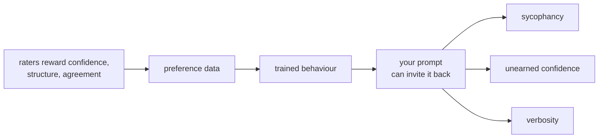

# Chapter 3 — Control

### Acting on what Formation described

<div class="mt-10 text-xl opacity-85">

Every technique in this chapter steers something that was rated. That is why it is
here and not before Chapter 2.

</div>

---

## Why this chapter comes second

<v-clicks>

- Technique taught before mechanism produces cargo-cult prompting: a list of tricks, no way to tell a good one from a superstition, and nothing to fall back on when one stops working.
- You have just spent Chapter 2 inside the rating process. You know what was rewarded.
- So each technique here comes with the same question: **what was rated, that this steers?**

</v-clicks>

<div v-click class="mt-8 text-lg">

And the ones that have no answer to that question get flagged, not taught.

</div>

---

## Before you tune a single word

The vendor's own documentation states what it assumes you already have:

<v-clicks>

- A clear definition of the success criteria for your task
- **Some way to test empirically against those criteria**
- A first draft prompt to improve

</v-clicks>

<div v-click class="mt-8 text-lg">

Most prompting advice skips straight past the middle item. Without it you cannot tell
an improvement from a coincidence — and neither can the person who told you the trick.

</div>

<div v-click class="mt-4 text-sm opacity-75 border-t pt-3">

**Thread opened — verification.** Chapter 4 builds the missing middle item.

</div>

<Cite k="anthropic-prompting" />

---

## Be specific

The documentation's own test, and it is a good one:

<div class="mt-4 p-4 border-l-4 text-lg" style="border-color:#0E5C68; background:#F2F7F8">

Show your prompt to a colleague with minimal context on the task and ask them to
follow it. **If they'd be confused, Claude will be too.**

</div>

<v-clicks>

- Be explicit about the output format and the constraints.
- Where order or completeness matters, give the steps as a numbered list.
- If you want effort beyond the obvious, ask for it. Do not expect it to be inferred.

</v-clicks>

<div v-click class="mt-6 text-sm opacity-80">

**Maps to:** instruction following — the dimension your Chapter 2 rubric scored hardest.
A vague prompt cannot be failed on instruction following, because there was no
instruction to follow.

</div>

<Cite k="anthropic-prompting" />

---

## Say why, not just what

A constraint with a reason attached generalises. A bare rule does not.

<div class="grid grid-cols-2 gap-6 mt-4 text-sm">
<div class="p-3 border-l-4" style="border-color:#97591A; background:#F8F1E7">

**Weaker**

Always state units.

</div>
<div class="p-3 border-l-4" style="border-color:#0E5C68; background:#F2F7F8">

**Stronger**

Always state units. This goes into a report where a reader may convert the value, and a
bare number gets converted wrongly.

</div>
</div>

<v-clicks>

- The second version covers cases you did not enumerate — a table, a figure caption, an appendix.
- The documentation puts it plainly: the model generalises from the explanation.

</v-clicks>

<Cite k="anthropic-prompting" />

---

## Structure the input

When a prompt mixes instructions, background, data and examples, tag each part so they
cannot be confused with one another.

```xml
<instructions>
  Check the calculation below and report every step where a unit is dropped.
</instructions>

<context>
  This is from a draft methods section. It will be read by a reviewer.
</context>

<input>
  ...the working to be checked...
</input>
```

<v-clicks>

- Use consistent, descriptive tag names. Nest them when the content has a real hierarchy.
- **This is also your first defence against prompt injection.** If instructions and data are visibly separated, text arriving inside `<input>` is easier to treat as data. Chapter 6 shows how far that gets you, which is not as far as you would like.

</v-clicks>

<Cite k="anthropic-prompting" />

---

## Examples do more than instructions

Examples are the most reliable way to steer format, tone and structure.

<v-clicks>

- **Relevant** — mirror the real task, not a toy version of it.
- **Diverse** — cover edge cases, and vary enough that no unintended pattern is picked up.
- **Structured** — wrap each in `<example>` tags so they are not mistaken for instructions.
- Three to five is the documented sweet spot.

</v-clicks>

<div v-click class="mt-6 text-sm opacity-80">

**Maps to:** house style. In Chapter 2 you were handed a rewrite checklist and told to
apply it without explanation. Examples are the same mechanism, pointed the other way —
you are now the one specifying the voice.

</div>

<Cite k="anthropic-prompting" />

---

## Negative examples, and their cost

Showing what you do **not** want works, and it carries a risk the positive case does not.

<v-clicks>

- A negative example still puts the unwanted pattern into the context window.
- Prefer stating the desired behaviour. The documentation's rule: **tell it what to do instead of what not to do.**
- Where a negative example is genuinely clearer, label it unmistakably and pair it with the corrected version.

</v-clicks>

<Cite k="anthropic-prompting" />

---

## Role — and exactly what is being claimed

Setting a role in the system prompt is the most repeated advice in circulation.

<v-clicks>

- The documentation says a role **focuses behaviour and tone** for your use case, and that even one sentence makes a difference.
- Read that carefully. It is a claim about *behaviour and tone*.
- It is **not** a claim that a persona makes the model more factually correct.

</v-clicks>

<div v-click class="mt-6 p-4 border-l-4 text-lg" style="border-color:#97591A; background:#F8F1E7">

*"You are an expert structural engineer"* — does that make the answer more **accurate**?

That is a different claim, it is testable, and **Chapter 4 tests it.** Do not settle it
here from intuition, and notice how badly you want to.

</div>

<Cite k="anthropic-prompting" />

---

## Requesting reasoning — read the original scope

Chain-of-thought prompting is real and it is well evidenced. It is also routinely
described as something it was not.

<v-clicks>

- The original result: prompting with **eight worked chain-of-thought exemplars**, on a 540-billion-parameter model, improving arithmetic, commonsense and symbolic reasoning.
- The paper states the ability emerges in *sufficiently large* models.
- That is a result about supplying worked examples. It is **not** a result about typing *"think step by step"* at a model that already reasons before answering.

</v-clicks>

<div v-click class="mt-6 text-sm opacity-80">

Whether the folk version still buys you anything on the model you actually use is,
again, **Chapter 4**.

</div>

<Cite k="wei2022" />

---

## Thinking and effort

<v-clicks>

- Current models use **adaptive thinking**: the model decides when and how much to think, calibrated by an `effort` setting and by how hard your query is.
- Higher effort elicits more thinking. Easy queries get answered directly.
- More thinking is not free — it costs tokens and latency, which is Chapter 7's material and Chapter 13's bill.

</v-clicks>

<div v-click class="mt-6 text-sm opacity-80">

**Two version-specific facts, true as fetched and worth re-checking before you rely on them.**
`budget_tokens` is deprecated and returns an error on recent models — use `effort`, or
`max_tokens` as a hard ceiling. And on Opus 5, raising or lowering effort does **not**
reliably change visible response length; ask for concision explicitly instead.

</div>

<Cite k="anthropic-prompting" />

---

## You are on the other side of the rubric now

In Chapter 2 you rated. Under time pressure, you rewarded confidence, structure and
length. So did everyone before you, at scale, and that became preference data.



<div class="text-sm opacity-80">

The next three slides are not style advice. They are ways of accidentally asking for the
behaviour you were warned about.

</div>

---

## Anti-pattern: the leading question

<div class="grid grid-cols-2 gap-6 mt-2 text-sm">
<div class="p-3 border-l-4" style="border-color:#97591A; background:#F8F1E7">

**Invites agreement**

"I think this approach is the right one — do you agree?"

"Confirm that this method is appropriate here."

</div>
<div class="p-3 border-l-4" style="border-color:#0E5C68; background:#F2F7F8">

**Invites analysis**

"Give the strongest case against this approach, then the strongest case for it."

"Under what conditions would this method be the wrong choice?"

</div>
</div>

<v-clicks>

- Agreement was rewarded during rating. Asking a question with a preferred answer visible in it is asking for the trained behaviour.
- You will not notice, because the answer will agree with you.

</v-clicks>

---

## Anti-pattern: asking for a verdict

<v-clicks>

- *"Is this correct?"* returns a judgement, and a judgement can be delivered confidently on no evidence.
- *"Work through this and show where it fails, or state that you found nothing"* returns something you can check.
- The second is longer, slower, and the only one of the two you can audit.

</v-clicks>

<div v-click class="mt-6 text-lg">

A verdict is cheap to produce and expensive to verify. An analysis is the other way round.

</div>

<div v-click class="mt-4 text-sm opacity-75 border-t pt-3">

**Forward reference — Chapter 5.** The stated reasoning is not a guarantee of the actual
mechanism. Asking for the working helps you catch errors; it does not prove the working
caused the answer.

</div>

---

## Anti-pattern: constraint stacking

<div class="mt-2 p-4 border-l-4" style="border-color:#97591A; background:#F8F1E7">

"Summarise this in under 100 words. Include every assumption. Cite each source.
Do not leave anything material out."

</div>

<v-clicks>

- These requirements conflict. Something has to give, and you did not say which.
- The model will not usually stop and tell you the brief is impossible. It will satisfy the ones it can and quietly drop the rest.
- **Name the priority explicitly:** which constraint wins when they collide.

</v-clicks>

<div v-click class="mt-6 text-sm opacity-80">

This is the same failure as an over-specified rubric, seen from the author's side. In
Chapter 2 an impossible rubric produced noisy ratings. Here it produces a confident
answer that silently missed half the brief.

</div>

---

## Prompts do not port

Everything on the preceding slides is calibrated to one provider's models.

<v-clicks>

- Tag conventions, role handling, thinking and effort controls, default verbosity — all provider-specific, and several are specific to a *version*.
- A prompt tuned on one model and moved to another is an untested prompt, not a working one.
- The documentation itself is organised model by model, and already carries exceptions for individual releases.

</v-clicks>

<div v-click class="mt-6 text-sm opacity-75 border-t pt-3">

**Sets up Chapter 12.** When you reach outside this session — a second provider, a
retrieval tool, an agent someone else wrote — you are re-testing, not reusing.

</div>

<Cite k="anthropic-prompting" />

---

## What you can take on trust, and what you cannot

<div class="text-sm mt-2">

| | Standing |
|---|---|
| Be specific; state constraints; give the steps in order | Documented, and it maps to a rated dimension |
| Explain why a constraint exists | Documented, with a stated mechanism |
| Structure with tags; 3–5 relevant, diverse examples | Documented, with stated bounds |
| Tell it what to do rather than what not to do | Documented |
| A role improves **tone and behaviour** | Documented |
| A role improves **accuracy** | **Not established. Chapter 4.** |
| *"Think step by step"* helps a modern reasoning model | **Not established. Chapter 4.** |

</div>

<div v-click class="mt-6 text-lg">

The bottom two rows are the reason the next chapter exists. Everything above them you
can act on tomorrow; those two you should test before you believe.

</div>

---

## Where this leaves us

<v-clicks>

- Technique, with a mechanism attached to each piece of it.
- Three anti-patterns that are not style errors — they are requests for trained behaviour you already watched being trained.
- Two widely repeated claims, deliberately left open.

</v-clicks>

<div v-click class="mt-10 text-2xl">

You now have claims. **Chapter 4 is how you test one.**

</div>
