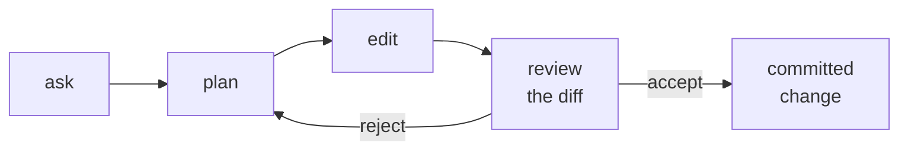

# Chapter 9 — The agent

### Working with a system that acts

Session 1 was a system that answers. This one edits your files.

---

## Start where the barrier is lowest

<v-clicks>

- **Desktop app and the editor extension first.** The terminal is optional and it is taught last.
- A browser fallback exists for a machine that fights the install. Nobody in this room should lose the afternoon to a package manager.
- The terminal is not the skill. The skill is everything on the following slides, and it is identical in all three.

</v-clicks>

Terminal-first teaching filters for people who already have the tool. This room does not,
and the filter would remove the audience rather than the difficulty.

<Cite k="claudecode-docs" />

---

## The permission model is the safety story

<v-clicks>

- Read-only by default. Nothing is written until you say so.
- Every proposed edit is shown as a **diff** before it is applied.
- Permissions are per action, and can be narrowed or broadened per project.

</v-clicks>

**The diff is the artefact of responsibility.** It is the moment the change becomes
yours. Approving a diff you have not read is the whole risk of this chapter in one action.

<Cite k="claudecode-docs" />

---

## The working loop

<v-clicks>

- **Plan before edit.** Plan mode produces the intended change as text, before a single file is touched, and it is far cheaper to reject a plan than a patch.
- The loop is the same whether the task takes one turn or forty.

</v-clicks>

<Cite k="claudecode-docs" />

---

## Context engineering is the skill

Not a footnote. This is the single thing that separates competent agent use from
incompetent agent use.

<v-clicks>

- Everything in the session shares one bounded window — your files, the outputs, the tool results, the conversation.
- It fills. Chapter 5 told you what happens to accuracy as it fills, and Chapter 7 told you what it costs.
- Nothing warns you at the moment it starts mattering.

</v-clicks>

**Thread — memory and context.** Introduced in Chapter 1 as a bounded buffer, watched
degrading in Chapter 5, named as the missing hippocampus in Chapter 8. This is where you
manage it. Chapter 10 is where you replace it.

---

## Three moves, and knowing which one

<v-clicks>

- **Compact** — summarise the session so far and continue. Cheap, lossy, and the loss is invisible.
- **Clear** — discard and start fresh in the same project. Loses everything not written to a file.
- **Abandon** — start a new session because this one has gone wrong in a way summarising will not fix.

</v-clicks>

The third is the one people will not do, because the session feels expensive to lose.
It is not. **It has already cost you the thing you were protecting.**

---

## Demonstration: what contamination looks like

<v-clicks>

- Run one task in a fresh session. Record the answer.
- Run the same task after a long, unrelated conversation in the same session. Record the answer.
- Compare.

</v-clicks>

**TODO(capture)** — instructor to record this pair in advance, with the model ID and the
date. The point is not that the second answer is wrong; often it is not. The point is
that you could not have predicted which.

This is Chapter 4's noise floor, met again in a place where it costs you working hours
instead of a grading sheet.

---

## Session commands worth knowing on day one

<v-clicks>

- Check your setup and configuration when something behaves oddly, before you debug the thing itself.
- Check your usage early in the session, not when you hit the limit mid-demonstration.
- Resume a previous session when you need the reasoning, not just the result.

</v-clicks>

**Version-fragile.** Command names, flags and behaviours change between releases. These
are correct as recorded, and get re-checked in the week before the session rather than
trusted from a slide written months earlier.

<Cite k="claudecode-docs" />

---

## Exercise

Point it at one of your own MATLAB scripts.

<v-clicks>

1. Ask for an explanation of what the script does. Read it against what you know the script does.
2. Ask for **one small reversible change**.
3. Read the diff before accepting it. Say out loud what the change does.
4. Reject it once, on purpose, and watch what happens.

</v-clicks>

Step 4 is not padding. Most people never reject anything, and then discover the reject
path during something that matters.

---

## Where this leaves us

<v-clicks>

- A system that acts, with a permission model and a diff as the point of responsibility.
- A bounded window you are now actively managing rather than passively filling.
- Three moves, and the discipline to use the third.

</v-clicks>

Everything here still dies with the session. **Chapter 10 is where you stop losing it.**

