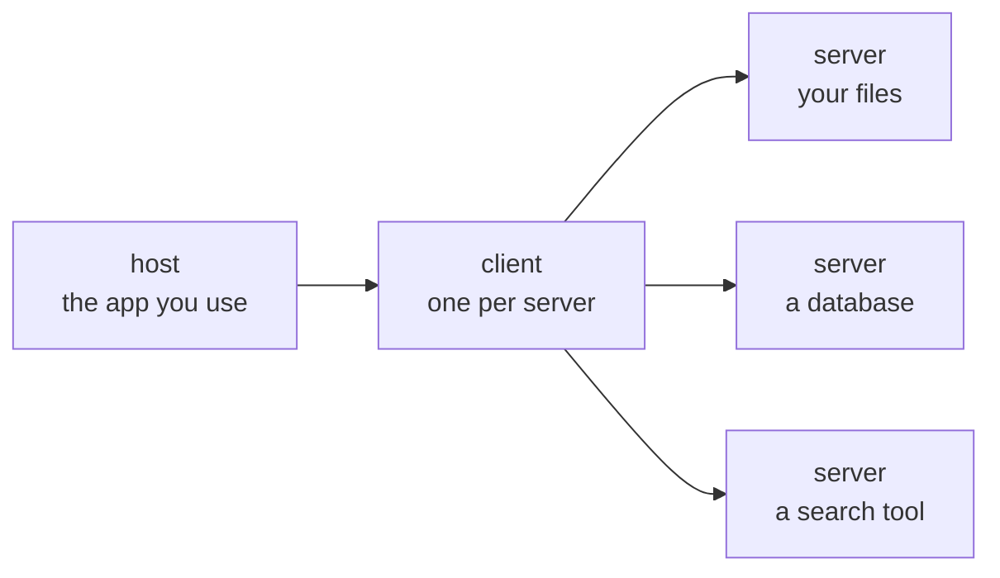

# Chapter 12 — Extension

### Reaching outside the session

Chapter 6 drew a trust boundary. This chapter is the room opening it on purpose,
knowing what it costs.

---

## The problem a protocol solves

<v-clicks>

- Every tool you might connect — a database, a document store, a second provider — has its own interface.
- Without a common protocol that is N tools times M clients of bespoke integration, and none of it is reusable.
- A protocol collapses that to N plus M. That is the entire motivation, and it is the same argument as any other interface standard you have met.

</v-clicks>

---

## Host, client, server

<v-clicks>

- The **server** exposes capability. It is usually small and often something you can write.
- The **client** speaks the protocol. You do not write it.
- The **host** is the application you are already using.

</v-clicks>

---

## Three things a server can expose

<v-clicks>

- **Tools** — actions the model may call. This is the one with consequences.
- **Resources** — data the model may read. Files, records, documents.
- **Prompts** — reusable prompt templates the server offers to the host.

</v-clicks>

Keep the first two distinct in your head. A tool **does** something; a resource is
something read. Chapter 6's whole failure mode is content from the second class being
treated as an instruction from the first.

---

## Graphing a codebase or a document set

<v-clicks>

- Build a local, queryable map of code, documents and PDFs, and then ask questions of the map instead of reading files one at a time.
- Edges are labelled by how they were obtained: **extracted** from the syntax tree, or **inferred**. Those are not the same evidence and the map says which.
- Commit the map so the group shares one picture rather than six.

</v-clicks>

**Two cautions that belong together.** Pin the version of a fast-moving dependency, or the
map you commit today is not the map you rebuild next month. And the **semantic pass over
documents leaves the machine while the code pass does not** — which makes it a Chapter 18
data-governance question, not a convenience question.

---

## Cross-provider retrieval: a licensing asymmetry

Different providers hold different content licences. A second provider reachable from
the same session can retrieve sources the first is not licensed to return.

<v-clicks>

- Taught as **a licensing asymmetry with a provenance obligation**. Not as circumvention, and not as a trick.
- **Onward use may exceed the retrieving provider's terms.** Retrieval is not a licence to republish.
- **Source quality still has to be judged.** A second provider is not a second opinion.
- **Record the retrieval chain.** Which provider returned what, and when. Chapter 14 will require the identifier anyway.

</v-clicks>

Framed as circumvention this would be both wrong and fragile. Framed as an asymmetry with
an obligation attached, it survives a question from a librarian.

---

## Trust boundary, reopened

<v-clicks>

- Chapter 6: untrusted content entering the window is treated as instruction, and there is no complete defence.
- This chapter: you are now connecting servers that fetch content you did not write, on purpose, because it is useful.
- **Nothing about the threat changed. What changed is that you chose it.**

</v-clicks>

**Thread — trust boundary.** Introduced Chapter 2 as trained behaviour, attacked in
Chapter 6, opened voluntarily here, and governed in Chapter 18.

---

## Hands-on

**BLOCKED — needs the working Antigravity configuration.**

This chapter cannot be finished until the group's Gemini access path is documented:
what is actually invoked, and how results come back. See `DECISIONS.md` item 2.

Nothing on the preceding slides depends on it. The hands-on exercise does, entirely.

The exercise, once unblocked: connect one server, list what it exposes, call one tool,
read one resource, and record where the data went.

