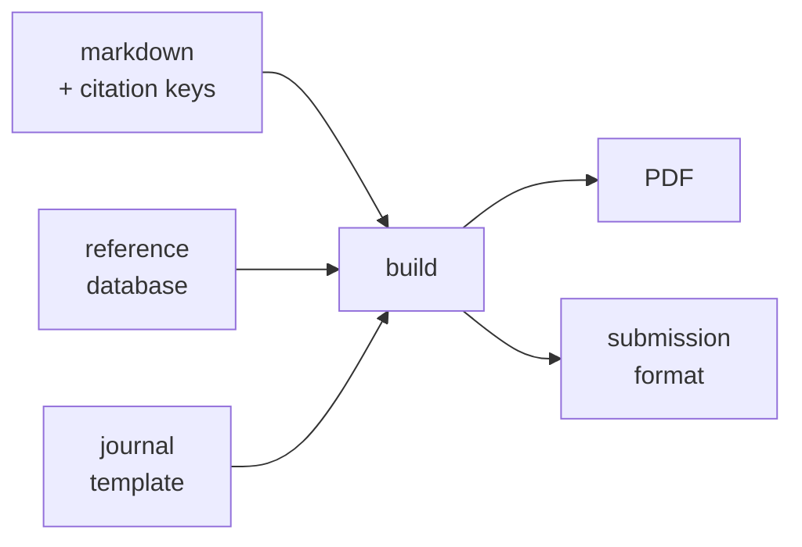

# Chapter 15 — Production

### Documents, figures and diagrams

Everything in this chapter is a text file under version control that renders into
something a journal will accept.

---

## Why a text pipeline beats a word processor

<v-clicks>

- **It diffs.** You can see what changed between drafts, and so can your supervisor.
- **It is reproducible.** The same source and the same template give the same document, on any machine.
- **Citations are data, not typing.** A bibliography is generated from identifiers, which is the Chapter 14 habit made mechanical.
- **Templates are swappable.** The same manuscript retargets to a different journal without reformatting by hand.

</v-clicks>

The cost is real: a build step, and a day of setup. Say that plainly rather than
pretending the trade is free.

---

## The pipeline in one line

<v-clicks>

- Cross-references, figure numbering and citation styling are handled by the build, not by you.
- The same source produces the preprint, the submission and the slides.

</v-clicks>

---

## Figures that can be regenerated

<v-clicks>

- A figure produced by a committed script can be audited, corrected and rebuilt. A figure pasted from a screenshot cannot.
- Where a figure has an equation behind it, the script **is** the derivation, and it is reviewable.
- Where input values are illustrative rather than measured, **say so on the figure itself**, not in the caption of a draft that will be edited.

</v-clicks>

**This course follows the same rule.** Chapters 1 and 5 carry computed figures generated
by a script in the repository, with illustrative inputs labelled inside the image itself
rather than in a caption. This chapter has no figures of its own — the diagram below is
text.

---

## Diagrams as text

<v-clicks>

- Flowcharts and system maps written as text render into diagrams, diff like code, and survive export.
- The alternative — a drawing tool — produces a binary nobody else can edit and nobody can review.
- For anything with boxes and arrows, text wins. For anything with data, plot it instead.

</v-clicks>

And for anything else: generated imagery carries **no provenance you control**, and
reproducing it depends on pinning a model, a seed and a sampler you do not own. In a
document that carries claims, that is the wrong trade — not because it is impossible to
reproduce, but because the reproducibility is somebody else's to withdraw.

---

## ASCII output has a real use

<v-clicks>

- Terminal output, code comments, commit messages, plain-text README files.
- A diagram inside a source file stays with the code it describes and needs no build step to read.
- Small, ugly and durable beats beautiful and detached.

</v-clicks>

---

## Explaining your own code to other people

<v-clicks>

- A supervisor, a collaborator, or you in eighteen months.
- Ask for the explanation, then **check it against what the code does**, not against what you meant it to do. The gap between those two is the useful output. Chapter 16 takes the same move on code you inherited and cannot read; here the audience is someone else.
- Where the explanation is wrong, that is usually the code being unclear rather than the reader being wrong.

</v-clicks>

Where the explanation is right, it goes in the project instruction file from Chapter 10,
and stops being re-derived every session.

---

## Exercise

<v-clicks>

1. Take one section of something you are writing. Put it through the pipeline end to end, with one real citation.
2. Retarget it to a second template and confirm nothing broke.
3. Regenerate one figure from a script and commit the script beside it.

</v-clicks>

If step 2 breaks, you have found the reason to do this now rather than the week before
a deadline.

